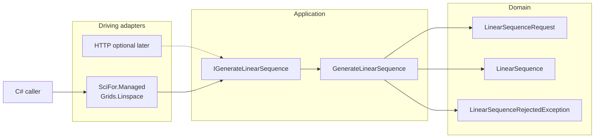

# SciFor (ADD migration demonstration)

A private proof of concept that **Artifact-Driven Development extends to migrating a legacy numerical library**. The worked example is a host-neutral C# API for representative SciFortran slices — not a SciFortran replacement, not a CLI, and not an ASP.NET rewrite.

VS-1 exposes inclusive `linspace` at a managed port and proves it against `FIX-001`. Later slices (`fermi`, `MATRIX`) reuse the same hexagonal layout.

Requirements and decisions live under `docs/requirements/` and `docs/decisions/`. Recovered legacy evidence lives under `docs/modernization/`.

## Table of Contents

- [Requirements](#requirements)
- [High-Level Architecture](#high-level-architecture)
- [Technical Stack](#technical-stack)
- [Key Design Decisions](#key-design-decisions)
- [Prerequisites](#prerequisites)
- [Getting Started](#getting-started)
- [Available Scripts](#available-scripts)
- [UI Components](#ui-components)
- [API Contract](#api-contract)
- [Environment Variables](#environment-variables)
- [Backlog Items](#backlog-items)
- [License](#license)

## Requirements

**Purpose and domain model**

- [docs/PURPOSE.md](docs/PURPOSE.md) — demonstration thesis, trade-off rule, anti-thesis, managed-API product boundary
- [docs/DOMAIN.md](docs/DOMAIN.md) — ubiquitous language, `LinearSequenceRequest` / `LinearSequence`, first-slice events, adapter vs domain split

Consumed requirement files (append-only):

- [docs/requirements/REQ-001-linspace.md](docs/requirements/REQ-001-linspace.md) — inclusive linear sequence (Draft; Gherkin S1–S6)

**Architecture decisions included for traceability for backlog alignment**

- [docs/decisions/ADR-001-first-slice-oracle-baseline.md](docs/decisions/ADR-001-first-slice-oracle-baseline.md) — Accepted; probe `e586903` is the BEH-001 oracle
- [docs/decisions/ADR-002-hexagonal-managed-api.md](docs/decisions/ADR-002-hexagonal-managed-api.md) — Accepted; hexagonal core; managed API is the first driving adapter
- [docs/decisions/ADR-003-linspace-numeric-contract.md](docs/decisions/ADR-003-linspace-numeric-contract.md) — Accepted; binary64; `FIX-001` exact parsed equality
- [docs/decisions/ADR-004-whole-library-csharp-port.md](docs/decisions/ADR-004-whole-library-csharp-port.md) — Accepted; POC authorization, narrowed by ADR-008
- [docs/decisions/ADR-005-planning-gate-scope.md](docs/decisions/ADR-005-planning-gate-scope.md) — Accepted; retained/retired scope; Fortran ABI not retained
- [docs/decisions/ADR-006-retire-cli-surface.md](docs/decisions/ADR-006-retire-cli-surface.md) — Accepted; no CLI adapter
- [docs/decisions/ADR-007-io-and-host-concerns-are-adapters.md](docs/decisions/ADR-007-io-and-host-concerns-are-adapters.md) — Accepted; I/O, diagnostics channel, and exit status are adapters
- [docs/decisions/ADR-008-demonstration-first-slice-scope.md](docs/decisions/ADR-008-demonstration-first-slice-scope.md) — Accepted; build VS-1, VS-2, VS-3 only
- [docs/decisions/ADR-009-vs1-managed-port-and-layout.md](docs/decisions/ADR-009-vs1-managed-port-and-layout.md) — **Proposed**; solution layout, `IGenerateLinearSequence`, `Grids.Linspace`
- [docs/decisions/ADR-010-typed-domain-failure.md](docs/decisions/ADR-010-typed-domain-failure.md) — **Proposed**; `LinearSequenceRejectedException` / `LinearSequenceRejection`

`REQ-001` is still **Draft** (Gate 2). ADR-009 and ADR-010 are **Proposed** (Gate 4). Implementation stories wait until those are accepted.

## High-Level Architecture

VS-1 is a class library. The managed API is the driving adapter. There is no driven I/O port on this slice: linspace is pure evaluation.



**How this preserves purpose and domain boundaries**

- Arithmetic lives in Application/Domain, not in a host. The same port can later be called from HTTP without touching the formula (PURPOSE north-star; ADR-002).
- `LinearSequence` evaluation is the VS-1 consistency boundary (`docs/DOMAIN.md` §7a). Invalid length never becomes a process `STOP`.
- Text codecs, CLI parsing, and console diagnostics are outside this diagram (ADR-006, ADR-007).
- VS-3 will add a driven numeric-provider port under Application; that port does not exist yet and must not be invented in Domain for linspace.

**Flow (REQ-001)**

1. Caller invokes `new Grids().Linspace(start, stop, length)`.
2. Adapter builds `LinearSequenceRequest` and calls `IGenerateLinearSequence.Generate`.
3. Use case validates length **before** allocating samples (S5, S6, DEF-002).
4. On success it returns `LinearSequence.Samples` using the inclusive formula (S1–S4). Parity is claimed only for S1 / `FIX-001`.

## Technical Stack

| Layer | Technology | Rationale |
|-------|------------|-----------|
| Language / runtime | C# / .NET 8 (`net8.0`) | Target stack in ADR-004; class library, not a web host |
| Architecture | Hexagonal ports and adapters | ADR-002; methodology requirement |
| Domain / application | `SciFor.Domain`, `SciFor.Application` | Host-neutral numeric contract (`REQ-001`, ADR-009) |
| Driving adapter | `SciFor.Managed` (`Grids.Linspace`) | Product surface; parity is judged here (ADR-002, ADR-003) |
| Numerics (VS-1) | IEEE-754 binary64 (`double`) | ADR-003; no BLAS/LAPACK on this slice |
| Test runner | xUnit | Contract, integration, and `FIX-001` parity tests (ADR-009) |
| Build | SDK-style `SciFor.sln`, `dotnet` CLI | Replaces GNU Make for the target (GAP-017) |
| HTTP / ASP.NET | Not in VS-1 | Optional later adapter over the same port (ADR-002, ADR-008) |
| CLI | Not built | ADR-006 |
| Logging library | None in VS-1 | Pure evaluation; failures are typed exceptions, not log lines (ADR-010) |

## Key Design Decisions

### 1. Demonstration fragment, not a library port

ADR-008 builds three slices. README, package ID `SciFor`, and type names must not claim coverage of unbuilt modules. Reserve catalog rows stay reserve.

### 2. Hexagonal split with project references

Domain cannot reference adapters. That is how PURPOSE’s “no compile-time I/O/CLI/hosting dependency” is checked. See [ADR-009](docs/decisions/ADR-009-vs1-managed-port-and-layout.md).

### 3. Ubiquitous language in Domain, Fortran job name on the adapter

`LinearSequenceRequest` / `LinearSequence` are the domain types. The managed method is `Linspace` so the recovered job stays recognizable. Closed for VS-1 only; `fftgf` and MATRIX names wait for their slices.

### 4. No DI container in VS-1

`Grids` wires `GenerateLinearSequence` itself. Constructor injection of `IGenerateLinearSequence` exists for tests. A container is a host concern for a future HTTP adapter.

### 5. Typed domain failure, not `STOP`

Invalid length throws `LinearSequenceRejectedException` with `LinearSequenceRejection` (`NegativeLength` / `InclusiveLengthBelowTwo`). Fortran message text and exit codes are not the contract. See [ADR-010](docs/decisions/ADR-010-typed-domain-failure.md).

### 6. Parity only where fixtures exist

S1 uses exact parsed equality against `FIX-001`. S2–S4 are specified from the ADR-003 formula and are not T1 until additional fixtures exist. Do not use workflow `1e-6` or script `1e-10` on this slice.

### 7. Solution layout is empty until the first port story

This design names projects and types. `/plan-project` then `/plan-port-story` produce the implementation-ready story. Do not add a compiling scaffold that has no `linspace` contract (ASSESSMENT §6).

### Project Structure

```
sci-fortran-port/
├── README.md                          # this design doc
├── SciFor.sln                         # created by the first port story
├── src/
│   ├── SciFor.Domain/
│   │   ├── DomainFailureException.cs
│   │   └── Grids/
│   │       ├── LinearSequenceRequest.cs
│   │       ├── LinearSequence.cs
│   │       ├── LinearSequenceRejection.cs
│   │       └── LinearSequenceRejectedException.cs
│   ├── SciFor.Application/
│   │   └── Grids/
│   │       ├── IGenerateLinearSequence.cs
│   │       └── GenerateLinearSequence.cs
│   └── SciFor.Managed/
│       └── Grids.cs                   # driving adapter; NuGet ID SciFor
├── tests/
│   └── SciFor.Tests/
│       ├── Unit/
│       ├── Contract/
│       ├── Integration/
│       └── Parity/                    # FIX-001 via Grids.Linspace
└── docs/
    ├── PURPOSE.md
    ├── DOMAIN.md
    ├── requirements/REQ-001-linspace.md
    ├── decisions/ADR-001 … ADR-010
    ├── features/                      # stories from /plan-port-story
    └── modernization/                 # recovered evidence, not the product
```

### Logging and Observability

- **Logger** — None in VS-1 Domain/Application/Managed. The slice is a pure function plus a typed exception. Introducing `Microsoft.Extensions.Logging` here would be a host concern without a host.
- **Format** — TBD when a host adapter exists. Prefer structured JSON in that adapter, not in Domain.
- **Request/correlation IDs** — Not applicable to the class library. An HTTP adapter would generate them in middleware.
- **Log levels** — Standard `debug` / `info` / `warn` / `error` if a later adapter logs `DomainFailureException.Code` at `warn`.
- **Sensitive data** — VS-1 inputs are numeric start/stop/length. Do not log unrelated secrets if a host is added. Fortran diagnostic strings must not be reintroduced as a log contract.

## Prerequisites

- [.NET 8 SDK](https://dotnet.microsoft.com/download/dotnet/8.0)
- No Fortran toolchain, OpenBLAS, or Numerical Recipes source is required to **build the C# slice**. Those remain oracle-side for fixture provenance (ADR-001).
- Contained re-runs of the legacy probe, if needed for new captures, stay off the read-only legacy checkout (`docs/modernization/migration-plan.md` §8).

## Getting Started

The solution is not in the tree until the first port story is implemented. After that:

```bash
# From the repo root
dotnet build SciFor.sln
dotnet test SciFor.sln
```

There is no web URL. Exercise the product in tests or:

```csharp
using SciFor;

var sequence = new Grids().Linspace(0.0, 1.0, 5);
// sequence.Samples == 0, 0.25, 0.5, 0.75, 1  (FIX-001)
```

### Configure environment

None for VS-1. No `.env` file.

### Run the dev servers

Not applicable. This slice is a class library.

## Available Scripts

| Command | Description |
|---------|-------------|
| `dotnet build SciFor.sln` | Build / type-check |
| `dotnet test SciFor.sln` | Unit, contract, integration, and parity tests |
| `dotnet pack src/SciFor.Managed/SciFor.Managed.csproj` | Private POC package (`SciFor`); do not publish as SciFortran |

No lint command is chosen yet. `/plan-port-story` may add `dotnet format --verify-no-changes` as the Z2 stand-in. Treat warnings as errors in the project files (ADR-009).

## UI Components

Not applicable — no UI in VS-1 (ADR-006, ADR-008).

## API Contract

This is a **managed library API**, not HTTP. Optional HTTP would call `IGenerateLinearSequence` and is out of this slice.

| Surface | Member | Purpose |
|---------|--------|---------|
| `SciFor.Grids` | `Linspace(double start, double stop, int length)` | Inclusive linear sequence (`REQ-001` S1–S6) |
| `SciFor.Domain.Grids.LinearSequence` | `IReadOnlyList<double> Samples` | Zero-based binary64 samples |
| `SciFor.Domain.Grids.LinearSequenceRejectedException` | thrown | S5/S6 typed failure; see `Reason` / `Code` |

| Attribute | Value |
|-----------|-------|
| Method | `Linspace` (instance method on `Grids`) |
| Path | n/a (no HTTP) |
| Auth | none |
| Query | n/a |
| Request | `start: double`, `stop: double`, `length: int` (inclusive defaults; no endpoint flags) |
| Response | `LinearSequence` or `LinearSequenceRejectedException` |

`IGenerateLinearSequence` is the inbound port. `Grids` is the driving adapter. Tests that claim product parity must go through `Grids.Linspace`, not only the use case.

## Environment Variables

None for VS-1.

| Variable | Default | Description |
|----------|---------|-------------|
| — | — | No runtime configuration. Provider/environment pinning is an oracle concern (ADR-001), not a library setting. |

## Backlog Items

TBD — `/plan-project` appends epics and stories. This design does not invent story IDs.

Intended VS-1 epic (not scheduled until `/plan-project`):

- Port `BEH-001` / `REQ-001` behind `IGenerateLinearSequence` and `Grids.Linspace`, with `FIX-001` parity (S1) and specified formula/failure coverage (S2–S6).

VS-2 (`fermi`) and VS-3 (`MATRIX`) remain later epics per [docs/modernization/migration-plan.md](docs/modernization/migration-plan.md). They each still need `/document-legacy` before refine/design.

## License

MIT © Philip Teitel

This repository is a private ADD demonstration. It is not a license to redistribute restricted Fortran, Numerical Recipes, or Intel headers (ADR-004, ADR-005).
