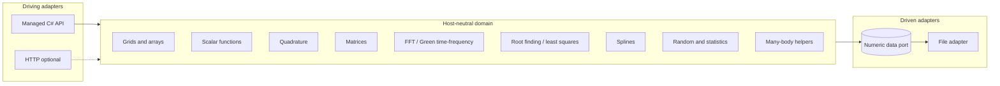
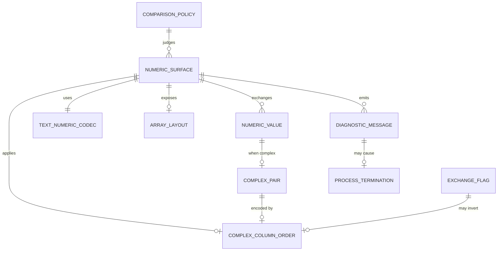

<!--
Domain model artifact contract:
- This file is produced or updated by /model-domain (modeler in Domain mode) or /recover-domain (modeler in Legacy recovery mode).
- Save it to the configured domain path (default `docs/DOMAIN.md`).
- DOMAIN.md is canonical for ubiquitous language, data meaning, entities, relationships, invariants, lifecycles, and consistency boundaries.
- Every term, field, invariant, lifecycle, and relationship must trace to source material or a resolved question.
- Open modeling questions block design or story planning for affected scope.
-->

# Domain Model: SciFortran numerical library (C# port)

**Source material:**
- `docs/PURPOSE.md` (whole-library POC)
- `src/SCIFOR.f90` public facade at `e586903`
- `docs/modernization/behavior-catalog.md`
- ADRs 001-005
- First recovered subdomain: BEH-001 `linspace`
- Cross-cutting contracts: BEH-301-305 (numeric kind, array layout/bounds, text codec, complex-column order, `STOP` diagnostics) and flow `BEH-304-fftgf-complex-column-io`
- `docs/modernization/intent-ledger.md` (INT-006/007)
- `docs/modernization/legacy-map.md` sections 2, 5-6
- `docs/modernization/ASSESSMENT.md` sections 1, 8-9
- `docs/modernization/defect-ledger.md` (DEF-001-004; DEF-301-313)

**Date:** 2026-08-19
**Status:** Draft (library-wide bounded contexts; linspace recovered in detail; cross-cutting contracts recovered)

---

## 1. Purpose alignment

The purpose is to demonstrate that Artifact-Driven Development extends to migration, using a C# port of retained SciFortran numerics as the worked example (`docs/PURPOSE.md`, ADR-008). Numerical jobs must keep their legacy meaning: generate grids, evaluate functions, integrate, invert and diagonalize matrices, transform Green functions, optimize, interpolate, sample.

This model names every bounded context recovered from the legacy system, because the domain model documents what the legacy system *is*. Only three contexts are built (ADR-008); the rest are marked reserve. CLI programs are retired from build scope (ADR-006), and file I/O is a driven port rather than a domain context (ADR-007). It does not model ASP.NET, MPI, or missing plot/FFT backends.

The model also names the ubiquitous language for the **numeric representation, array layout, text interchange, complex-column order, and diagnostic/termination** contracts recovered in BEH-301-305. Those contracts cut across every bounded context below: a module port is not faithfully translated merely by reproducing its arithmetic, because kind, layout, codec, column order, and termination semantics are separately observable. Sections that carry both passes are split into a first-slice/library part and a cross-cutting part.

## 2. Ubiquitous language

Two recovery passes contributed vocabulary. Both are canonical; they describe different layers of the same port.

### 2a. Library, port, and adapter vocabulary

| Term | Definition | Accepted aliases | Do not use | Source |
|------|------------|------------------|------------|--------|
| SciFor library | The retained public numerical capability formerly imported via `use SCIFOR` | managed port, C# library | “ASP.NET app” as the product | `src/SCIFOR.f90`; ADR-004 |
| Port | Host-neutral application service for one retained Fortran public procedure or cohesive family | use case | HTTP endpoint as the domain | ADR-002, ADR-005 |
| Driving adapter | Something that invokes a port (managed C# API; HTTP optional later). No CLI adapter is built (ADR-006) | managed API surface | “the Fortran program is the domain” | ADR-002, ADR-006 |
| Driven adapter | Something a port invokes to reach the outside — persistence, serialization, transport. File I/O lives here (ADR-007) | data port; file adapter | “`splot` is a domain operation” | ADR-007 |
| Linear sequence | Ordered evenly spaced real samples over an interval | `linspace` result | Fortran `array(num)` as a product noun | BEH-001 |
| Start / Stop / Length | Inclusive-grid request fields | `start`, `stop`, `num` | CLI-only `wmin`/`L` as library defaults | BEH-001 |
| Domain failure | Call rejected instead of returning a result | legacy `error`/`STOP` | HTTP status as the domain concept | ADR-002 |
| Probe baseline | Accepted POC oracle revision and environment | `e586903` probe | “production SciFortran release” | ADR-001, ADR-005 |

### 2b. Numeric, layout, text, and diagnostic contract vocabulary

| Term | Definition | Accepted aliases | Do not use | Source |
|------|------------|------------------|------------|--------|
| `NumericValue` | A scalar or array element quantity exchanged or computed as a kind-8 real or complex under the accepted Fortran numeric environment. | kind-8 value; real/complex quantity | “double” as proven portable width; “float” as API kind | `E3` BEH-301; `src/COMVARS.f90:13-39` |
| `NumericKind` | The Fortran kind selection for public numerics: dominant `8` for reals/complexes; aliases `dbl`/`dp` = 8; declared `ddp` = 16 without found `real(16)`/`complex(16)` declarations. | kind-8; `dbl`/`dp` | assuming `ddp` is an active public API | `E3`/`E5` BEH-301; GAP-008 |
| `ComplexPair` | A complex value as two real components in memory: Fortran intrinsic `(real_part, imag_part)`. Distinct from external column order. | complex components; `(re,im)` in memory | equating memory order with file/CLI column order | `E3` BEH-301/304; `COMVARS` / `cmplx(...,8)` |
| `ComplexColumnOrder` | Surface-specific ordering of the two external real columns that encode a complex value: `(Re, Im)` or `(Im, Re)`. Not a repository-wide convention. | external pair order; column swap semantics | “canonical complex format” (global) | `E2`/`E3` BEH-304; GAP-013 |
| `ExchangeFlag` | CLI option (`ex`) that, on documented surfaces, exchanges real/imaginary roles for input and/or output. Observed behavior is surface-specific and sometimes unused after parse. | `ex`; exchange Real/Imag | assuming `ex` works the same on every utility | `E2`/`E3` BEH-304; `fftgf`/`ffcmplx` |
| `ArrayLayout` | Fortran array addressing and storage: default lower bound 1 for `array(n)`, column-major for rank ≥ 2, with intentional non-default bounds (e.g. `0:L`, `-N:N`) on some surfaces. | Fortran shape/bounds; column-major matrix layout | C# zero-based/row-major as the domain default | `E3` BEH-302; GAP-005 |
| `TextNumericCodec` | Named family of plain-text numeric interchange for a surface: list-directed (`*`) and/or fixed formats (e.g. `es24.17`, `F18.10`, `g16.9`), including delimiter/exponent/locale sensitivity. | list-directed I/O; fixed-width numeric format | “JSON number”; assuming workflow text normalization is legacy emission | `E3`/`E1`/`E2` BEH-303; GAP-007 |
| `DiagnosticMessage` | User-visible diagnostic text on Fortran unit `*` (stdout), optionally ANSI-styled, in categories error / warning / msg. | console message; `error`/`warning`/`msg` text | structured Problem Details as legacy domain | `E3` BEH-305; `COMVARS` |
| `ProcessTermination` | Ending the process after a fatal path (typically bare `STOP`, occasionally `stop <code>`). Not a portable exit-code taxonomy. | `STOP`; abort-as-error | assuming Unix stderr + nonzero exit as legacy contract | `E3`/`E5` BEH-305; GAP-026 |
| `ComparisonPolicy` | Rules for judging numeric/text equality in verification (exact bytes, absolute/relative/ULP/residual, normalization). **Provisional knobs exist; no accepted product policy yet.** | tolerance; parity compare rule | treating `1e-6` or `1e-10` as approved product truth | `E2`/`E3`/`E4` BEH-301/303; INT-006; workflow config |
| `NumericSurface` | A named library API or CLI/file path that exposes numeric contracts (kinds, layout, codecs, diagnostics). Prefer surface names from evidence (`fftgf`, `deriv`, `sread`/`splot` overload, fidelity driver section). | retained surface; CLI utility; library API | inventing unlisted product modules as in-scope | `E3` legacy-map §5; BEH-301–305 |

## 3. Bounded contexts

| Context | Meaning | Legacy module(s) | Catalog IDs | Build status |
|---------|---------|------------------|-------------|--------------|
| Grids and arrays | Inclusive/log/integer/power meshes, sort/shift, derivatives | `TOOLS` | BEH-001–BEH-005, BEH-010 | **VS-1** (`linspace`); rest reserve |
| Scalar functions | Fermi, step, sign, Faddeeva | `FUNCTIONS` public exports | BEH-003, BEH-020 | **VS-2** (`fermi`); rest reserve |
| Matrices | Inverse, eigen, linear solve | `MATRIX` | BEH-040 | **VS-3** |
| Quadrature | Trapezoid/Simpson, Kramers–Kronig | `INTEGRATE` | BEH-030 | Reserve |
| Transforms | FFT and imaginary-time/frequency maps | `FFTGF` (NR) | BEH-050 | Reserve; permitted VS-3 substitute |
| Optimization | Broyden, Brent, MINPACK facades | `OPTIMIZE` | BEH-060 | Reserve |
| Splines | Linear/cubic/poly interpolation | `SPLINE` | BEH-070 | Reserve |
| Random and statistics | Sampling, histogram, moments | `RANDOM`, `STATISTICS` | BEH-080 | Reserve |
| Many-body helpers | Green-function types, Padé, square lattice, Bethe DOS | `GREENFUNX`, `PADE`, `SQUARE_LATTICE`, Bethe in `TOOLS` | BEH-090 | Reserve |

**Not bounded contexts, by decision:**

- **File and plot data** (`IOTOOLS`, BEH-100) is a **driven port with adapters**, not a domain context (ADR-007). The domain hands values across the port; an adapter decides persistence. Legacy `splot`/`sread` formats are evidence, not specification.
- **CLI adapters** (`numutils/src/*`, BEH-200+) are **retired from build scope** (ADR-006). Their catalog entries remain as recovered evidence about how library procedures were called.
- **Diagnostics, timing, CLI parsing** (BEH-110) are **dissolved** (ADR-007). Only failure *classification* is domain, as a typed domain failure.

The cross-cutting contracts (BEH-301–305) are **not** a bounded context either. They are constraints each context must satisfy at its boundary. ADR-007 splits them: `BEH-301` (numeric kind), `BEH-302` (array layout) and the classification half of `BEH-305` bind the domain; `BEH-303` (text codecs), `BEH-304` (external column order) and the channel/styling/exit half of `BEH-305` are adapter concerns with no fidelity requirement.

Identifier blocks in use, so the two recovery passes stay distinguishable:

| Block | Meaning |
|-------|---------|
| `BEH-001`-`BEH-005` | Individually recovered grid/function behaviors |
| `BEH-010`-`BEH-110` | Context anchors per legacy module (`BEH-100` reshaped, `BEH-110` dissolved) |
| `BEH-200`+ | CLI programs — recovered evidence only, not built |
| `BEH-301`-`BEH-305` | Cross-cutting numeric/text/diagnostic contracts |

## 4. Data dictionary

### 4a. Recovered first-slice subdomain

First recovered entities remain those of BEH-001. Other contexts get dictionaries during their `/document-legacy` slice.

| Field | Owner entity | Type / format | Required? | Constraints | Source |
|-------|--------------|---------------|-----------|-------------|--------|
| `LinearSequenceRequest.start` | LinearSequenceRequest | binary64 | Yes | Unconstrained in recovered code | BEH-001 |
| `LinearSequenceRequest.stop` | LinearSequenceRequest | binary64 | Yes | Unconstrained in recovered code | BEH-001 |
| `LinearSequenceRequest.length` | LinearSequenceRequest | integer count | Yes | Inclusive default requires `>= 2`; `< 0` is a domain failure | BEH-001 |
| `LinearSequence.samples` | LinearSequence | ordered binary64 list | Yes on success | FIX-001: exact `0,0.25,0.5,0.75,1` | FIX-001; ADR-003 |

### 4b. Cross-cutting contract fields

These fields describe contracts that apply across retained surfaces rather than to a single function.

| Field | Owner entity | Type / format | Required? | Constraints / allowed values | Source of value | Source |
|-------|--------------|---------------|-----------|------------------------------|-----------------|--------|
| `NumericValue.kind` | `NumericValue` | Fortran kind selector; public API dominated by 8 | Yes for public real/complex APIs | Kind-8 binary float components; exact IEEE width TBD | System / compiler environment | `E3`/`E5` BEH-301 |
| `NumericValue.realPart` | `ComplexPair` / `NumericValue` | kind-8 real | Yes when complex | Paired with `imagPart` in memory as Fortran `(re,im)` | Computation or decode | `E3` BEH-301/304 |
| `NumericValue.imagPart` | `ComplexPair` / `NumericValue` | kind-8 real | Yes when complex | Same as above | Computation or decode | `E3` BEH-301/304 |
| `ArrayLayout.lowerBound` | `ArrayLayout` | integer index bound | Yes | Default 1 unless declared otherwise (`0:`, `-N:N`, …) | Declaration / allocator | `E3` BEH-302 |
| `ArrayLayout.upperBound` | `ArrayLayout` | integer index bound | Yes | Part of callable contract when explicit | Declaration / allocator | `E3` BEH-302 |
| `ArrayLayout.rank` | `ArrayLayout` | integer ≥ 1 | Yes | Rank-2+ storage is column-major | Declaration | `E3` BEH-302 |
| `ArrayLayout.leadingDimension` | `ArrayLayout` | integer LDA | Conditional (matrix/LAPACK paths) | Taken from `size(M,1)` where observed | Derived from actual argument | `E3` BEH-302 |
| `ComplexColumnOrder.externalOrder` | `ComplexColumnOrder` | enum-like: `(Re,Im)` \| `(Im,Re)` | Yes per surface ingress/egress | Surface- and sometimes overload-specific; may differ input vs output | Surface reader/writer | `E2`/`E3` BEH-304 |
| `ExchangeFlag.enabled` | `ExchangeFlag` | boolean (`ex`) | No (default false where parsed) | Documented bidirectional exchange; unused after parse on `ffcmplx` | CLI parse | `E2`/`E3` BEH-304 |
| `TextNumericCodec.formatFamily` | `TextNumericCodec` | list-directed \| fixed (named format string) | Yes per surface | Compiler/locale-sensitive bytes | Surface I/O statements | `E3`/`E5` BEH-303 |
| `TextNumericCodec.locale` | `TextNumericCodec` | process locale | Unknown for production | Probe forced `LC_ALL=C`; other locales uncharacterized | Environment | `E1`/`E5` BEH-303 |
| `DiagnosticMessage.severity` | `DiagnosticMessage` | error \| warning \| msg | Yes | `abort` is alias of error | Caller | `E3` BEH-305 |
| `DiagnosticMessage.text` | `DiagnosticMessage` | free-text string | Yes for printed diagnostics | May be ANSI-decorated | Caller / helpers | `E3` BEH-305 |
| `DiagnosticMessage.destination` | `DiagnosticMessage` | Fortran unit `*` (stdout) | Yes for observed helpers | Not a dedicated stderr unit in inspected paths | System | `E3` BEH-305 |
| `ProcessTermination.stopCode` | `ProcessTermination` | optional integer | Conditional | Bare `STOP` unspecified; fidelity open failure uses `stop 1` | Source path | `E3`/`E5` BEH-305 |
| `ComparisonPolicy.absoluteTolerance` | `ComparisonPolicy` | floating threshold | TBD | Script default `1e-10` absolute; not accepted product policy | Script / config (provisional) | `E3`/`E4` INT-006; BEH-301 |
| `ComparisonPolicy.relativeTolerance` | `ComparisonPolicy` | floating threshold | TBD | Workflow provisional `1e-6`; conflicts with script | Config (provisional) | `E2`/`E4` workflow; BEH-301 |
| `ComparisonPolicy.textNormalization` | `ComparisonPolicy` | trim / newline / case rules | TBD | Workflow defaults are future comparison policy, not legacy emission | Config (provisional) | `E2` BEH-303 |

## 5. Core entities

### 5a. First-slice entities

#### LinearSequenceRequest / LinearSequence

Unchanged from the 2026-08-19 linspace recovery: value objects, no persistence, inclusive formula, typed domain failure instead of `STOP`. See BEH-001.

Library-wide entities (Matrix, Transform, Histogram, …) are **TBD per slice** and must not be invented here.

### 5b. Cross-cutting contract entities

#### `NumericValue`

- **Meaning:** Kind-8 real or complex quantity in SciFortran public numerics and CLI utilities.
- **Key attributes:** `kind`, scalar vs array element, for complex: `realPart`, `imagPart`
- **Identity:** Value identity is the numeric quantity under the accepted kind/environment; not a durable business key.
- **Invariants:**
  - Public API is dominated by `real(8)` / `complex(8)`.
  - Complex memory pairing is Fortran `(re,im)` components.
  - Exact portable byte width and IEEE edge behavior remain uncharacterized until measured (`E5`).
- **Lifecycle:** Created by computation, list-directed/fixed decode, or constructors such as `cmplx(...,8)`; exchanged via arrays/streams/files.
- **Source:** `E3`/`E5` BEH-301

#### `ComplexPair`

- **Meaning:** The in-memory real/imaginary component pairing of a complex `NumericValue`.
- **Key attributes:** `realPart`, `imagPart`
- **Identity:** Same as the owning complex `NumericValue`.
- **Invariants:**
  - Memory components remain `(re,im)` even when external columns are `(Im,Re)`.
  - Diagnostic `txtfy` strings render `(re,im)` text regardless of some file/CLI column writers.
- **Lifecycle:** Encoded/decoded at surface boundaries according to that surface’s `ComplexColumnOrder` and optional `ExchangeFlag`.
- **Source:** `E3` BEH-301/304; flow BEH-304 §4

#### `ComplexColumnOrder`

- **Meaning:** The external two-column convention for a named `NumericSurface` ingress and/or egress.
- **Key attributes:** `externalOrder`, surface identity, direction (input/output)
- **Identity:** Named surface + direction + (when applicable) overload (e.g. integer-X vs real-X).
- **Invariants:**
  - Order is **not** universal across the repository.
  - Help text and coded readers/writers may disagree; contradictions are tensions until defect disposition.
- **Lifecycle:** Applied at read/write boundaries; may flip under `ExchangeFlag` where implemented.
- **Source:** `E2`/`E3` BEH-304; GAP-013

#### `ArrayLayout`

- **Meaning:** Indexing, bounds, and storage association for numeric arrays exposed by SciFortran surfaces.
- **Key attributes:** `lowerBound`, `upperBound`, `rank`, optional `leadingDimension`
- **Identity:** The array argument’s shape/bounds as observed by Fortran assumed-shape/explicit declarations.
- **Invariants:**
  - Default `array(n)` allocations are 1-indexed.
  - Rank-2 storage is column-major; LAPACK LDA from `size(M,1)` where observed.
  - Non-default bounds on some FFT/time-domain surfaces are intentional contract.
- **Lifecycle:** Allocated/filled/mutated by library or stream→list→`allocate` utilities; section/non-contiguous cases `E5`.
- **Source:** `E3`/`E5` BEH-302

#### `TextNumericCodec`

- **Meaning:** How a `NumericSurface` encodes/decodes numbers as plain text.
- **Key attributes:** `formatFamily`, optional fixed format string, `locale` (often unknown)
- **Identity:** Named surface + I/O direction + format family.
- **Invariants:**
  - CLI streams primarily use list-directed I/O; file codecs mix `*` and fixed formats by overload.
  - Exact delimiter/exponent/special-value bytes are compiler/locale-sensitive until captured.
  - Workflow trim/newline/case rules are comparison policy, not legacy emission.
- **Lifecycle:** Applied on each read/write; EOF ends many stdin loops.
- **Source:** `E1`/`E2`/`E3`/`E5` BEH-303

#### `DiagnosticMessage`

- **Meaning:** Printed diagnostic communication to the user/operator.
- **Key attributes:** `severity`, `text`, `destination`, optional MPI-rank gating
- **Identity:** Ephemeral emission event, not a persisted entity.
- **Invariants:**
  - `error` prints then terminates; `abort` is the same as `error`.
  - `warning` and `msg` print without stopping.
  - Destination observed is stdout (`*`), possibly ANSI-styled.
- **Lifecycle:** Emitted on validation/help/failure/update paths; may precede `ProcessTermination`.
- **Source:** `E3` BEH-305

#### `ProcessTermination`

- **Meaning:** Process-ending outcome of fatal diagnostics or help (without status-return mode).
- **Key attributes:** `stopCode` (often unspecified)
- **Identity:** End of process lifetime for that invocation.
- **Invariants:**
  - After `error`/`abort` (when printed under MPI gate), bare `stop` executes.
  - Help without optional `status` out-param stops after printing.
  - Portable nonzero exit status must not be assumed for bare `STOP` (`E5`).
- **Lifecycle:** Terminal; partial prior side effects possible but largely uncatalogued (`E5`).
- **Source:** `E3`/`E5` BEH-305

#### `ComparisonPolicy`

- **Meaning:** Verification rules for comparing modernized outputs to legacy observations.
- **Key attributes:** absolute/relative/ULP/residual/exact-byte choices; text normalization knobs
- **Identity:** Per-surface (or per-fixture) policy once approved; today only provisional knobs exist.
- **Invariants:**
  - TBD: no accepted product invariant yet—provisional `1e-6` vs `1e-10` conflict; probe exact equality is not a product tolerance policy.
- **Lifecycle:** Chosen during oracle/acceptance setup; must not be silently inferred from workflow defaults.
- **Source:** `E1`/`E2`/`E3`/`E4` BEH-301/303; INT-006; ASSESSMENT §9

#### `NumericSurface`

- **Meaning:** A concrete library or CLI/file entrypoint that binds the above contracts.
- **Key attributes:** name, I/O mode (stdin/stdout/file/API), retained/retired status (**TBD** for most utilities)
- **Identity:** Entrypoint name + overload where contracts split (e.g. `sreadV_IC` vs `sreadV_RC`).
- **Invariants:**
  - Contracts are surface-specific; global defaults are invalid without an owner decision.
  - Support/build inclusion can differ from source presence (e.g. `ffcmplx` omitted from default `all`).
- **Lifecycle:** Invoked by consumers/pipelines; may terminate via `ProcessTermination`.
- **Source:** `E3` legacy-map §5; BEH-302/304/305

## 6. Relationships

### 6a. Port and adapter relationships

| Relationship | Cardinality | Notes | Source |
|--------------|-------------|-------|--------|
| LinearSequenceRequest → LinearSequence | one-to-one on success | First recovered job | BEH-001 |
| Driving adapter → library port | many adapters, one arithmetic | No adapter reimplements arithmetic. Only the managed API exists today; HTTP is optional | ADR-002, ADR-006 |
| Library port → driven data port | one-to-many | The domain hands values across the port; the adapter chooses serialization. No legacy-format fidelity | ADR-007 |

### 6b. Contract relationships

| Relationship | Cardinality | Ownership / lifecycle dependency | Source |
|--------------|-------------|-----------------------------------|--------|
| `NumericSurface` -> `NumericValue` | one-to-many | Surface exchanges values for a call/run | `E3` BEH-301–304 |
| `NumericSurface` -> `TextNumericCodec` | one-to-one (per direction/family) | Codec owned by surface contract | `E3` BEH-303 |
| `NumericSurface` -> `ComplexColumnOrder` | zero-or-one per direction | Only complex-column surfaces | `E2`/`E3` BEH-304 |
| `NumericValue` -> `ComplexPair` | zero-or-one | Present when kind is complex | `E3` BEH-301 |
| `ComplexPair` -> `ComplexColumnOrder` | many-to-one via surface | Encoding rule belongs to surface, not the value | `E3` BEH-304 flow |
| `ExchangeFlag` -> `ComplexColumnOrder` | optional modifier | Parsed CLI control; effect surface-specific | `E2`/`E3` BEH-304 |
| `NumericSurface` -> `ArrayLayout` | one-to-many arguments | Arrays carry layout of actual arguments | `E3` BEH-302 |
| `DiagnosticMessage` -> `ProcessTermination` | zero-or-one | Fatal severities terminate; warning/msg do not | `E3` BEH-305 |
| `ComparisonPolicy` -> `NumericSurface` | many-to-one (intended) | Policy selected per surface/fixture when approved | `E4`/`E5` BEH-301/303 |

## 7. Aggregates / consistency boundaries

### 7a. Port boundaries

| Boundary | Protects | External interactions |
|----------|----------|----------------------|
| Linear sequence evaluation (VS-1) | Inclusive formula and length rules | Managed API |
| Scalar function evaluation (VS-2) | Fermi parameterization and sweep semantics | Managed API |
| Dense linear algebra (VS-3) | Inverse/eigen/solve contracts, layout, and provider substitution | Managed API; numeric provider behind a driven port |
| Each reserve module port | That module’s public contract | Managed API, if ever built |

Process-global `COMMON_VARS` state is no longer an aggregate question: `TIMER` is dropped and diagnostics are adapter concerns (ADR-007). Process-global RNG state (GAP-015) remains a reserve concern for `BEH-080`, which is not built.

### 7b. Contract boundaries

| Boundary | Entities inside | Invariants protected | External interactions | Design implications |
|----------|-----------------|----------------------|-----------------------|---------------------|
| `InMemoryNumericBoundary` | `NumericValue`, `ComplexPair`, `ArrayLayout` | Kind-8 components; `(re,im)` memory pairing; Fortran bounds/column-major semantics | Encoded streams/files; host buffers | Host layout adapters must not silently rewrite domain bounds/order — **design deferred** |
| `SurfaceCodecBoundary` | `NumericSurface`, `TextNumericCodec`, `ComplexColumnOrder`, `ExchangeFlag` | Per-surface text and column contracts; no global codec | stdin/stdout/files; help text | **Legacy characterization only.** Under ADR-007 no built surface reproduces a text or column contract; the codecs recorded here explain what the legacy did and why the contradictions were retired rather than fixed |
| `DiagnosticTerminationBoundary` | `DiagnosticMessage`, `ProcessTermination` | Fatal vs non-fatal; stdout emission; STOP semantics | Host process; optional help status return | **Split by ADR-007.** Which conditions are fatal is a domain invariant expressed as a typed failure; emission channel and exit status are adapter concerns |
| `VerificationBoundary` | `ComparisonPolicy` (+ fixtures) | Must not claim accepted product tolerances from provisional knobs | Oracle captures; scripts | Blocks parity stories until approved |

## 8. Lifecycles and state transitions

These record **legacy behavior as recovered**, not target design. The complex-column and diagnostic lifecycles below belong to surfaces that ADR-006/007 place outside the product boundary; they are kept because they are the evidence behind the retired defect rows.

### `ComplexPair` across a complex-column surface (e.g. `fftgf`)

| From state | Event / command | Guard | To state | Side effects | Source |
|------------|-----------------|-------|----------|--------------|--------|
| External columns | list-directed read | default `ex=false` | Memory `(Re,Im)` via `cmplx(rey,imy)` | Accumulate/transform | `E3` BEH-304 flow §3.1 |
| External columns | list-directed read | `ex=true` | Memory `(Re,Im)` via swapped `cmplx` | Same | `E3` BEH-304 |
| Memory `(Re,Im)` | default complex write | `ex=false` | External `(Im, Re)` | stdout/file lines | `E3` BEH-304 |
| Memory `(Re,Im)` | exchanged write | `ex=true` | External `(Re, Im)` | stdout/file lines | `E3` BEH-304 |
| Memory `(Re,Im)` | `iw2tau` egress | type=`iw2tau` | External real-only | No complex columns | `E3` BEH-304 flow |

### `DiagnosticMessage` / `ProcessTermination`

| From state | Event / command | Guard | To state | Side effects | Source |
|------------|-----------------|-------|----------|--------------|--------|
| Running | `msg` / `warning` | n/a | Running | Print to stdout | `E3` BEH-305 |
| Running | `error` / `abort` | mpiID gate matches (default) | Terminated | Print error; bare `STOP` | `E3`/`E5` BEH-305 |
| Running | help flags | no `status` out-param | Terminated | Print help; `STOP` | `E3` BEH-305 |
| Running | help flags | `status` present | Running (help signaled) | Print help; set status; return | `E3` BEH-305 |
| Running | fidelity open failure | `iostat /= 0` | Terminated | Print; `stop 1` | `E3` BEH-305 |

### `ComparisonPolicy`

No approved lifecycle yet. Provisional knobs exist; promotion to accepted policy is an open modeling/purpose question. `E2`/`E3`/`E4`/`E5` — BEH-301/303; INT-006.

## 9. Domain events

### 9a. First-slice events

| Event | When | Source |
|-------|------|--------|
| LinearSequenceProduced | Evaluation succeeds | BEH-001 |
| LinearSequenceRejected | Length/endpoint rule fails | BEH-001; `REQ-001` S5/S6; `LinearSequenceRejectedException` (ADR-010, Accepted) |

### 9b. Contract-level events

| Event | Emitted when | Carries | Consumers / observers | Source |
|-------|--------------|---------|-----------------------|--------|
| `NumericValuesDecoded` | Successful list-directed/fixed read into memory | values + surface codec + column order used | Transform/compute paths | `E3` BEH-303/304 |
| `NumericValuesEncoded` | Successful write of values to stream/file | values + codec + column order | CLI/pipeline consumers | `E3` BEH-303/304 |
| `DiagnosticEmitted` | `msg`/`warning`/`error` print path | severity, text | Operators; logs (legacy: stdout) | `E3` BEH-305 |
| `ProcessStopped` | bare/`coded` STOP after fatal/help | optional stop code | Shell/host | `E3`/`E5` BEH-305 |
| `HelpRequested` | help argv tokens matched | help buffer lines | CLI user | `E3` BEH-305 |

## 10. Open modeling questions

### 10a. Library and first-slice questions

Library-wide (do not block VS-1):

- [x] Canonical C# names for **VS-1**: domain types use ubiquitous language (`LinearSequenceRequest`, `LinearSequence`); the managed adapter method is `Linspace` (ADR-009, Accepted). Other Fortran identifiers (`fermi`, `fftgf`, MATRIX names) wait for their slice.
- [ ] **Blocks VS-3.** Which MATRIX results require order/sign canonicalization? Eigenvalue ordering and eigenvector sign conventions are uncharacterized and must be settled in the VS-3 numeric-contract ADR.
- [x] How is process-global RNG/timer/diagnostic state exposed without request races — largely dissolved by ADR-007: `TIMER` is dropped and diagnostics are adapter concerns. Process-global RNG state survives only as a reserve concern for `BEH-080`, which is not built.

First-slice (closed by `/refine-feature` → `REQ-001`, 2026-08-20):

- [x] Expose `includeStart` / `includeStop` / `step` on the first managed port? **No for VS-1.** Inclusive start/stop/length only. Flags stay recovered in BEH-001 and unaccepted for parity.
- [x] Decreasing intervals and `start == stop` now or later? **Now, as formula-specified behavior** (`REQ-001` S3/S4). Not T1 until additional fixtures exist.
- [x] Domain-failure vocabulary vs leftover `N<0` / `N<2` strings? **Typed domain failure** (`REQ-001` S5/S6). Fortran message text is not the managed contract (ADR-007). C# type: `LinearSequenceRejectedException` with `LinearSequenceRejection` (ADR-010, Accepted).

### 10b. Cross-cutting contract questions

Still blocking for design/story planning in the built slices:

- [ ] Exact kind-8 storage width, endianness, IEEE mode, and edge (NaN/Infinity/signed-zero/subnormal) contract for the accepted compiler? `E5` — BEH-301
- [ ] Is `ddp=16` future intent, dead scaffolding, or required by unexamined paths? `E3`/`E5` — BEH-301
- [ ] Per built surface: accepted `ComparisonPolicy` (absolute/relative/ULP/residual)? Exact-byte comparison is off the table everywhere now that no surface carries a text-fidelity requirement (ADR-007). VS-3 is the hard case: elementwise equality is unlikely to be right for `MATRIX`. `E1`/`E2`/`E3`/`E4`/`E5` — BEH-301; INT-006; DEF-308
- [ ] Which public APIs must preserve non-default lower bounds vs normalize copies? Slice/view vs copy at the port boundary? **Blocks VS-3**, where Fortran column-major and leading-dimension conventions meet C# defaults. `E3`/`E5` — BEH-302

Closed or dissolved by the 2026-08-19 decisions:

- [x] Per complex surface: canonical **external** order and disposition of help-vs-code contradictions — dissolved by ADR-007. External column order is an adapter choice with no fidelity requirement; in-memory component pairing remains domain under BEH-301. DEF-301/302/305 retired with evidence.
- [x] Does `ffcmplx` `sread(fin,Gread,wm)` resolve/build, and is unused `ex` dead help or broken feature — retired unresolved (DEF-303/304). The utility is not built.
- [x] Are `sreadM_*` allocation/format anomalies latent defects or unreachable — retired unresolved (DEF-307). They appear to be legacy defects; not reproducing them is the intended outcome.
- [x] Observable effect of `fftgf` `stride` — retired unresolved (DEF-312). The utility is not built.
- [x] Does `r8_to_s_left` intend `G14.6` or `g16.9` — retired unresolved (DEF-311). Diagnostic formatting is an adapter concern.
- [x] Must ANSI styling and stdout-mixed diagnostics be preserved, and what exit status does bare `STOP` produce — retired unresolved (DEF-309/310). Channel, styling, and exit status are adapter concerns (ADR-007).
- [x] Which failures remain process-aborting vs become typed non-terminating results — closed by ADR-002 §4: `error`/`STOP` becomes a typed domain failure at the managed port. `E2` — GAP-026 now applies only to hypothetical adapter work.
- [x] Retained `NumericSurface` inventory — closed by ADR-005 §5, then narrowed to built slices by ADR-008.

## 11. Tensions / conflicts

### 11a. Scope and catalog tensions

- CLI defaults (e.g. `linspace` `wmin=-5`) are not library defaults, and no CLI is built (ADR-006). Library ports require explicit arguments. The CLI defaults survive only as evidence of intended usage. `E3`
- `FUNCTIONS` comments list a huge special-function collection, but the module’s public list is six names. The catalog follows **public exports**, not the include file. ADR-005.
- Fidelity `arange-5` is a driver loop, not library `arange`. BEH-005 stays T3, and is reserve rather than built.
- The catalog documents fifteen library families while three are built (ADR-008). Reserve entries must stay marked as reserve so the model is not read as a work commitment.

### 11b. Contract tensions

Do not pick a winner; affected design/story scope is stopped until disposition.

**Live — these block built slices:**

| Conflict | Sources | Impact |
|----------|---------|--------|
| Workflow relative/absolute `1e-6` vs fidelity absolute `1e-10` vs probe exact equality — three comparison regimes; none is accepted product policy | `E1`/`E2`/`E3`/`E4` — BEH-301; INT-006; DEF-308; ASSESSMENT §9 | Blocks parity stories and `ComparisonPolicy` approval for VS-2 and VS-3 |
| Kind-8 declarations abundant; portable equivalence to C# `double`/`Complex` unproven | `E3`/`E5` — BEH-301; GAP-008 | Blocks numeric representation claims |
| Fortran 1-based/column-major vs default C# 0-based/row-major; no accepted buffer decision | `E3`/`E5` — BEH-302; GAP-005 | Blocks array-boundary design for VS-3 |
| `MATRIX` eigenvalue ordering and eigenvector sign conventions uncharacterized; no T1 evidence | `E5` — BEH-040; ADR-008 | Blocks the VS-3 numeric-contract ADR |
| Probe-linked OpenBLAS behavior vs an unchosen managed or native provider | `E5` — GAP-010; DEP-012–018 | Blocks VS-3 implementation |
| Exercise authorization vs production/redistribution approval | `E2` — ASSESSMENT §1, Condition 2 | Blocks any framing of this work as production-ready |
| Operational probe baseline vs production/parity authority | `E1`/`E5` — ASSESSMENT Condition 1; INT open Qs | Blocks treating probe captures as accepted goldens without owner decision |

**Retired with evidence — recorded, unresolved, and out of the product boundary (ADR-006/007):**

| Conflict | Sources | Disposition |
|----------|---------|-------------|
| `r8_to_s_left` comment `G14.6` vs code `g16.9` | `E3` — BEH-303; DEF-311 | Diagnostic formatting is an adapter concern |
| Fidelity probe mixes `es24.17` and list-directed sections — no single global text codec | `E3` — BEH-303; DEF-004 | No surface carries a text-fidelity requirement; the harness still parses both |
| `fftgf` help claims `(re,im)`; default writer emits `(Im, Re)` | `E2`/`E3` — BEH-304; flow §5; DEF-301 | `fftgf` is not built |
| `fftgf` default input `(Re,Im)` vs output `(Im,Re)` — asymmetric ends | `E3` — BEH-304; DEF-302 | `fftgf` is not built |
| `ffcmplx` documents `ex` but never uses it; `sread` argument order vs `pade` | `E2`/`E3`/`E5` — BEH-304; DEF-303/304 | Not built; no legacy reader is ported |
| `SLREAD`/`SLPLOT` integer-X `(Re,Im)` vs real-X `(Im,Re)`; `txtfy` always `(re,im)` | `E3` — BEH-304; DEF-305/306 | External column order is an adapter choice (ADR-007) |
| `sreadM_*` allocation and duplicate-`imY(2)` anomalies | `E3`/`E5` — BEH-304; DEF-307 | Apparent legacy defects; legacy readers are not ported |
| Bare `STOP` vs fidelity `stop 1`; diagnostics on stdout vs stderr / Problem Details | `E3`/`E5` — BEH-305; GAP-026; DEF-309/310 | Channel and exit status are adapter concerns (ADR-002 §4, ADR-007) |

Retirement closes these for this effort. It does not resolve them, and each must be reopened before any future surface claims legacy compatibility.

## 12. Links

- Purpose: `docs/PURPOSE.md`
- Catalog: `docs/modernization/behavior-catalog.md`
- Migration plan: `docs/modernization/migration-plan.md`
- ADRs: ADR-001-010; further triggers in `docs/modernization/translation-gaps.md` GAP-005/007/008/009/013/026
- Design: `README.md`
- First-slice behavior: `docs/modernization/behaviors/BEH-001-linspace.md`; flow `docs/modernization/flows/BEH-001-linspace.md`
- Requirements: `docs/requirements/REQ-001-linspace.md`
- Cross-cutting behaviors: `docs/modernization/behaviors/BEH-301-*.md` ... `BEH-305-*.md`
- Cross-cutting flow: `docs/modernization/flows/BEH-304-fftgf-complex-column-io.md`
- Defect ledger: `docs/modernization/defect-ledger.md` (DEF-001-004 first slice; DEF-301-313 cross-cutting)

---

*Created: 2026-08-10 (contract recovery) | Updated: 2026-08-19 | Whole-library bounded contexts and cross-cutting contracts merged; rescoped per ADR-006/007/008 | `/refine-feature` BEH-001 → `REQ-001`: 2026-08-20 | `/design-application` ADR-009/010: 2026-08-20 | Plan: VS-1–VS-3 in `docs/modernization/migration-plan.md`*
