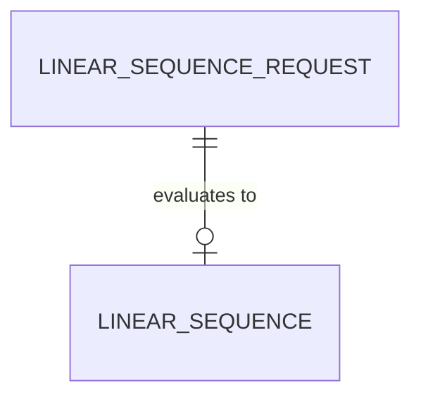

# Domain Model: Linear sequence generation (first slice)

**Source material:**
- `docs/PURPOSE.md`
- `docs/modernization/behaviors/BEH-001-linspace.md`
- `docs/modernization/flows/BEH-001-linspace.md`
- CLI help text in `numutils/src/linspace.f90` (job description only)
- `src/tools_grids.f90` `linspace` (code-derived rules)
- Owner decisions and ADRs 001–003 dated 2026-08-19

**Date:** 2026-08-19
**Status:** Draft (bounded to BEH-001)

---

## 1. Purpose alignment

The purpose of this exercise is to re-host one recovered numerical job: produce evenly spaced numbers over a specified interval. This model names only the concepts required for that job. It does not model FFT, matrices, plotting, or ASP.NET. See `docs/PURPOSE.md`.

## 2. Ubiquitous language

| Term | Definition | Accepted aliases | Do not use | Source |
|------|------------|------------------|------------|--------|
| Linear sequence | Ordered list of evenly spaced real samples over an interval | `linspace` result | “linspace array” as a product noun; Fortran-specific `array(num)` | BEH-001; CLI DESCRIPTION |
| Start | Value of the first sample when the start endpoint is included | `start`, CLI `wmin`/`a` | “left bound” | BEH-001; `src/tools_grids.f90:1`; `numutils/src/linspace.f90:22` |
| Stop | Value of the last sample when the stop endpoint is included | `stop`, CLI `wmax`/`b` | “right bound” | BEH-001; `src/tools_grids.f90:1`; `numutils/src/linspace.f90:23` |
| Length | Number of samples in the sequence | `num`, CLI `L` | “N” in user-facing text (legacy abort text still says `N`) | BEH-001; `numutils/src/linspace.f90:24` |
| Inclusive endpoints | Default mode: both Start and Stop appear in the sequence | default `istart`/`iend` true | NumPy parameter names as domain terms unless adopted later | `src/tools_grids.f90:8-14`; FIX-001 |
| Step | Uniform spacing between adjacent samples | `mesh` when returned | “delta” | `src/tools_grids.f90:13-14,29` |
| Domain failure | Call rejected instead of returning a sequence | legacy `error`/`STOP` | HTTP status, CLR exception type names | ADR-002; `src/COMVARS.f90:189-199` |

## 3. Data dictionary

| Field | Owner entity | Type / format | Required? | Constraints / allowed values | Source of value | Source |
|-------|--------------|---------------|-----------|------------------------------|-----------------|--------|
| `LinearSequenceRequest.start` | LinearSequenceRequest | real, kind-8 / binary64 | Yes | Unconstrained in recovered code | caller | BEH-001 §3 |
| `LinearSequenceRequest.stop` | LinearSequenceRequest | real, kind-8 / binary64 | Yes | Unconstrained in recovered code | caller | BEH-001 §3 |
| `LinearSequenceRequest.length` | LinearSequenceRequest | integer count | Yes | Must be `>= 2` for inclusive endpoints; `< 0` is a domain failure | caller | BEH-001 §3, §5 |
| `LinearSequenceRequest.includeStart` | LinearSequenceRequest | boolean | No (default true) | TBD whether first-slice port exposes this | caller or default | E3 `istart`; open question |
| `LinearSequenceRequest.includeStop` | LinearSequenceRequest | boolean | No (default true) | TBD whether first-slice port exposes this | caller or default | E3 `iend`; open question |
| `LinearSequence.samples` | LinearSequence | ordered list of reals, length = request.length | Yes on success | FIX-001: exact `0,0.25,0.5,0.75,1` | derived | FIX-001; ADR-003 |
| `LinearSequence.step` | LinearSequence | real | Conditional | Present if caller asked for `mesh`; `(stop-start)/(length-1)` when inclusive | derived | E3 `mesh`; open question |

## 4. Core entities

### LinearSequenceRequest

- **Meaning:** The caller’s specification of an interval and how many samples to take.
- **Key attributes:** `start`, `stop`, `length`; optional endpoint inclusion
- **Identity:** Value object; two requests with the same attributes are the same request
- **Invariants:**
  - `length` is an integer sample count, not a step size (CLI `RANGE` `a:b:L` uses L as length). `E3` — `numutils/src/linspace.f90:25,41`.
  - Inclusive default requires `length >= 2` or the call is a domain failure. `E3` — `src/tools_grids.f90:12`.
- **Lifecycle:** TBD: no persistent lifecycle; created per invocation
- **Source:** BEH-001

### LinearSequence

- **Meaning:** The ordered samples that satisfy a request.
- **Key attributes:** `samples`; optional `step`
- **Identity:** Value object determined by its samples
- **Invariants:**
  - `samples` count equals `length` on success.
  - Inclusive default: first sample equals `start` and last sample equals `stop` when the formula is exact (true for FIX-001). `E1/E3`.
  - Adjacent spacing equals `step` for the inclusive formula. `E3`.
- **Lifecycle:** TBD: no persistent lifecycle
- **Source:** BEH-001, FIX-001

## 5. Relationships

| Relationship | Cardinality | Ownership / lifecycle dependency | Source |
|--------------|-------------|-----------------------------------|--------|
| LinearSequenceRequest -> LinearSequence | one-to-one on success; none on domain failure | Sequence is derived; request is not persisted | BEH-001 |

## 6. Aggregates / consistency boundaries

| Boundary | Entities inside | Invariants protected | External interactions | Design implications |
|----------|-----------------|----------------------|-----------------------|---------------------|
| Linear sequence evaluation | LinearSequenceRequest, LinearSequence | Inclusive formula, length, abort rules | Managed-API driving adapter only in this slice | Host-neutral port; no I/O. ADR-002 |

## 7. Lifecycles and state transitions

### LinearSequenceRequest lifecycle

| From state | Event / command | Guard | To state | Side effects | Source |
|------------|-----------------|-------|----------|--------------|--------|
| Specified | Evaluate | inclusive and length >= 2 | Succeeded | LinearSequence produced | BEH-001 FIX-001 |
| Specified | Evaluate | length < 0, or inclusive and length < 2 | Failed | Domain failure; legacy STOP not retained at the port | BEH-001 §6; ADR-002 |

No stored entity states exist in the legacy function. `E3`.

## 8. Domain events

| Event | Emitted when | Carries | Consumers / observers | Source |
|-------|--------------|---------|-----------------------|--------|
| LinearSequenceProduced | Evaluation succeeds | samples (and step if requested) | Managed-API caller | BEH-001 |
| LinearSequenceRejected | Evaluation fails a length/endpoint rule | failure identity/message TBD | Managed-API caller | BEH-001 §6; open |

## 9. Open modeling questions

- [ ] Expose `includeStart` / `includeStop` / `step` on the first managed port, or only the inclusive three-argument job proven by FIX-001?
- [ ] Canonical name: keep `linspace` as an alias in the managed API, or use only “linear sequence”?
- [ ] Decreasing intervals and `start == stop` invariants: specify now or wait for fixtures?
- [ ] Domain-failure vocabulary vs leftover legacy string `N<0` / `N<2`.

## 10. Tensions / conflicts

- CLI defaults (`start=-5`, `stop=5`, `length=1024`) are not library defaults; the library requires explicit `start`, `stop`, and `num`. First slice follows the library. `E3` — `numutils/src/linspace.f90:31-33` vs `src/tools_grids.f90:1-2`.
- Implementation names (`istart`, `iend`, `mesh`) are candidate port fields, not yet approved ubiquitous language. Marked optional/TBD above.

## 11. Links

- Purpose: `docs/PURPOSE.md`
- Related ADRs: ADR-001, ADR-002, ADR-003
- Related behavior: `docs/modernization/behaviors/BEH-001-linspace.md`

---

*Created: 2026-08-19 | Modeled by: modeler in Legacy recovery mode (in-chat fallback; no subagent delegation)*
