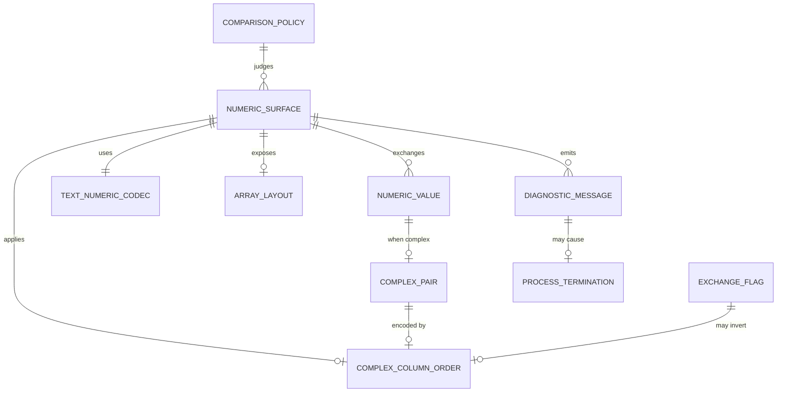

<!--
Domain model artifact contract:
- This file is produced or updated by /model-domain (modeler in Domain mode) or /recover-domain (modeler in Legacy recovery mode).
- Save it to the configured domain path (default `docs/DOMAIN.md`).
- DOMAIN.md is canonical for ubiquitous language, data meaning, entities, relationships, invariants, lifecycles, and consistency boundaries.
- Every term, field, invariant, lifecycle, and relationship must trace to source material or a resolved question.
- Open modeling questions block design or story planning for affected scope.
-->

# Domain Model: SciFortran numeric-contract modernization (framework exercise)

**Source material:**
- `docs/PURPOSE.md` (Draft, 2026-08-10)
- `docs/modernization/behaviors/BEH-101-numeric-kind-representation.md`
- `docs/modernization/behaviors/BEH-102-array-layout-bounds.md`
- `docs/modernization/behaviors/BEH-103-numeric-text-formatting.md`
- `docs/modernization/behaviors/BEH-104-complex-column-ordering.md`
- `docs/modernization/flows/BEH-104-fftgf-complex-column-io.md`
- `docs/modernization/behaviors/BEH-105-stop-error-diagnostics.md`
- `docs/modernization/intent-ledger.md` (INT-006/007)
- `docs/modernization/legacy-map.md` §§2, 5–6
- `docs/modernization/ASSESSMENT.md` §§1, 8–9
- `.cursor/workflow.config.yml` (provisional comparison defaults only)
- Defect ledger: absent as of 2026-08-10

**Date:** 2026-08-10
**Status:** Draft

---

## 1. Purpose alignment

This domain model names the ubiquitous language for the **numeric representation, array layout, text interchange, complex-column order, and diagnostic/termination** contracts recovered in BEH-101–105. It serves `docs/PURPOSE.md` by making those contracts explicit enough to judge conceptual fidelity for the authorized framework exercise—without inventing a full SciFortran commercial product model or target architecture.

## 2. Ubiquitous language

| Term | Definition | Accepted aliases | Do not use | Source |
|------|------------|------------------|------------|--------|
| `NumericValue` | A scalar or array element quantity exchanged or computed as a kind-8 real or complex under the accepted Fortran numeric environment. | kind-8 value; real/complex quantity | “double” as proven portable width; “float” as API kind | `E3` BEH-101; `src/COMVARS.f90:13-39` |
| `NumericKind` | The Fortran kind selection for public numerics: dominant `8` for reals/complexes; aliases `dbl`/`dp` = 8; declared `ddp` = 16 without found `real(16)`/`complex(16)` declarations. | kind-8; `dbl`/`dp` | assuming `ddp` is an active public API | `E3`/`E5` BEH-101; GAP-008 |
| `ComplexPair` | A complex value as two real components in memory: Fortran intrinsic `(real_part, imag_part)`. Distinct from external column order. | complex components; `(re,im)` in memory | equating memory order with file/CLI column order | `E3` BEH-101/104; `COMVARS` / `cmplx(...,8)` |
| `ComplexColumnOrder` | Surface-specific ordering of the two external real columns that encode a complex value: `(Re, Im)` or `(Im, Re)`. Not a repository-wide convention. | external pair order; column swap semantics | “canonical complex format” (global) | `E2`/`E3` BEH-104; GAP-013 |
| `ExchangeFlag` | CLI option (`ex`) that, on documented surfaces, exchanges real/imaginary roles for input and/or output. Observed behavior is surface-specific and sometimes unused after parse. | `ex`; exchange Real/Imag | assuming `ex` works the same on every utility | `E2`/`E3` BEH-104; `fftgf`/`ffcmplx` |
| `ArrayLayout` | Fortran array addressing and storage: default lower bound 1 for `array(n)`, column-major for rank ≥ 2, with intentional non-default bounds (e.g. `0:L`, `-N:N`) on some surfaces. | Fortran shape/bounds; column-major matrix layout | C# zero-based/row-major as the domain default | `E3` BEH-102; GAP-005 |
| `TextNumericCodec` | Named family of plain-text numeric interchange for a surface: list-directed (`*`) and/or fixed formats (e.g. `es24.17`, `F18.10`, `g16.9`), including delimiter/exponent/locale sensitivity. | list-directed I/O; fixed-width numeric format | “JSON number”; assuming workflow text normalization is legacy emission | `E3`/`E1`/`E2` BEH-103; GAP-007 |
| `DiagnosticMessage` | User-visible diagnostic text on Fortran unit `*` (stdout), optionally ANSI-styled, in categories error / warning / msg. | console message; `error`/`warning`/`msg` text | structured Problem Details as legacy domain | `E3` BEH-105; `COMVARS` |
| `ProcessTermination` | Ending the process after a fatal path (typically bare `STOP`, occasionally `stop <code>`). Not a portable exit-code taxonomy. | `STOP`; abort-as-error | assuming Unix stderr + nonzero exit as legacy contract | `E3`/`E5` BEH-105; GAP-026 |
| `ComparisonPolicy` | Rules for judging numeric/text equality in verification (exact bytes, absolute/relative/ULP/residual, normalization). **Provisional knobs exist; no accepted product policy yet.** | tolerance; parity compare rule | treating `1e-6` or `1e-10` as approved product truth | `E2`/`E3`/`E4` BEH-101/103; INT-006; workflow config |
| `NumericSurface` | A named library API or CLI/file path that exposes numeric contracts (kinds, layout, codecs, diagnostics). Prefer surface names from evidence (`fftgf`, `deriv`, `sread`/`splot` overload, fidelity driver section). | retained surface; CLI utility; library API | inventing unlisted product modules as in-scope | `E3` legacy-map §5; BEH-101–105 |

## 3. Data dictionary

| Field | Owner entity | Type / format | Required? | Constraints / allowed values | Source of value | Source |
|-------|--------------|---------------|-----------|------------------------------|-----------------|--------|
| `NumericValue.kind` | `NumericValue` | Fortran kind selector; public API dominated by 8 | Yes for public real/complex APIs | Kind-8 binary float components; exact IEEE width TBD | System / compiler environment | `E3`/`E5` BEH-101 |
| `NumericValue.realPart` | `ComplexPair` / `NumericValue` | kind-8 real | Yes when complex | Paired with `imagPart` in memory as Fortran `(re,im)` | Computation or decode | `E3` BEH-101/104 |
| `NumericValue.imagPart` | `ComplexPair` / `NumericValue` | kind-8 real | Yes when complex | Same as above | Computation or decode | `E3` BEH-101/104 |
| `ArrayLayout.lowerBound` | `ArrayLayout` | integer index bound | Yes | Default 1 unless declared otherwise (`0:`, `-N:N`, …) | Declaration / allocator | `E3` BEH-102 |
| `ArrayLayout.upperBound` | `ArrayLayout` | integer index bound | Yes | Part of callable contract when explicit | Declaration / allocator | `E3` BEH-102 |
| `ArrayLayout.rank` | `ArrayLayout` | integer ≥ 1 | Yes | Rank-2+ storage is column-major | Declaration | `E3` BEH-102 |
| `ArrayLayout.leadingDimension` | `ArrayLayout` | integer LDA | Conditional (matrix/LAPACK paths) | Taken from `size(M,1)` where observed | Derived from actual argument | `E3` BEH-102 |
| `ComplexColumnOrder.externalOrder` | `ComplexColumnOrder` | enum-like: `(Re,Im)` \| `(Im,Re)` | Yes per surface ingress/egress | Surface- and sometimes overload-specific; may differ input vs output | Surface reader/writer | `E2`/`E3` BEH-104 |
| `ExchangeFlag.enabled` | `ExchangeFlag` | boolean (`ex`) | No (default false where parsed) | Documented bidirectional exchange; unused after parse on `ffcmplx` | CLI parse | `E2`/`E3` BEH-104 |
| `TextNumericCodec.formatFamily` | `TextNumericCodec` | list-directed \| fixed (named format string) | Yes per surface | Compiler/locale-sensitive bytes | Surface I/O statements | `E3`/`E5` BEH-103 |
| `TextNumericCodec.locale` | `TextNumericCodec` | process locale | Unknown for production | Probe forced `LC_ALL=C`; other locales uncharacterized | Environment | `E1`/`E5` BEH-103 |
| `DiagnosticMessage.severity` | `DiagnosticMessage` | error \| warning \| msg | Yes | `abort` is alias of error | Caller | `E3` BEH-105 |
| `DiagnosticMessage.text` | `DiagnosticMessage` | free-text string | Yes for printed diagnostics | May be ANSI-decorated | Caller / helpers | `E3` BEH-105 |
| `DiagnosticMessage.destination` | `DiagnosticMessage` | Fortran unit `*` (stdout) | Yes for observed helpers | Not a dedicated stderr unit in inspected paths | System | `E3` BEH-105 |
| `ProcessTermination.stopCode` | `ProcessTermination` | optional integer | Conditional | Bare `STOP` unspecified; fidelity open failure uses `stop 1` | Source path | `E3`/`E5` BEH-105 |
| `ComparisonPolicy.absoluteTolerance` | `ComparisonPolicy` | floating threshold | TBD | Script default `1e-10` absolute; not accepted product policy | Script / config (provisional) | `E3`/`E4` INT-006; BEH-101 |
| `ComparisonPolicy.relativeTolerance` | `ComparisonPolicy` | floating threshold | TBD | Workflow provisional `1e-6`; conflicts with script | Config (provisional) | `E2`/`E4` workflow; BEH-101 |
| `ComparisonPolicy.textNormalization` | `ComparisonPolicy` | trim / newline / case rules | TBD | Workflow defaults are future comparison policy, not legacy emission | Config (provisional) | `E2` BEH-103 |

## 4. Core entities

### `NumericValue`

- **Meaning:** Kind-8 real or complex quantity in SciFortran public numerics and CLI utilities.
- **Key attributes:** `kind`, scalar vs array element, for complex: `realPart`, `imagPart`
- **Identity:** Value identity is the numeric quantity under the accepted kind/environment; not a durable business key.
- **Invariants:**
  - Public API is dominated by `real(8)` / `complex(8)`.
  - Complex memory pairing is Fortran `(re,im)` components.
  - Exact portable byte width and IEEE edge behavior remain uncharacterized until measured (`E5`).
- **Lifecycle:** Created by computation, list-directed/fixed decode, or constructors such as `cmplx(...,8)`; exchanged via arrays/streams/files.
- **Source:** `E3`/`E5` BEH-101

### `ComplexPair`

- **Meaning:** The in-memory real/imaginary component pairing of a complex `NumericValue`.
- **Key attributes:** `realPart`, `imagPart`
- **Identity:** Same as the owning complex `NumericValue`.
- **Invariants:**
  - Memory components remain `(re,im)` even when external columns are `(Im,Re)`.
  - Diagnostic `txtfy` strings render `(re,im)` text regardless of some file/CLI column writers.
- **Lifecycle:** Encoded/decoded at surface boundaries according to that surface’s `ComplexColumnOrder` and optional `ExchangeFlag`.
- **Source:** `E3` BEH-101/104; flow BEH-104 §4

### `ComplexColumnOrder`

- **Meaning:** The external two-column convention for a named `NumericSurface` ingress and/or egress.
- **Key attributes:** `externalOrder`, surface identity, direction (input/output)
- **Identity:** Named surface + direction + (when applicable) overload (e.g. integer-X vs real-X).
- **Invariants:**
  - Order is **not** universal across the repository.
  - Help text and coded readers/writers may disagree; contradictions are tensions until defect disposition.
- **Lifecycle:** Applied at read/write boundaries; may flip under `ExchangeFlag` where implemented.
- **Source:** `E2`/`E3` BEH-104; GAP-013

### `ArrayLayout`

- **Meaning:** Indexing, bounds, and storage association for numeric arrays exposed by SciFortran surfaces.
- **Key attributes:** `lowerBound`, `upperBound`, `rank`, optional `leadingDimension`
- **Identity:** The array argument’s shape/bounds as observed by Fortran assumed-shape/explicit declarations.
- **Invariants:**
  - Default `array(n)` allocations are 1-indexed.
  - Rank-2 storage is column-major; LAPACK LDA from `size(M,1)` where observed.
  - Non-default bounds on some FFT/time-domain surfaces are intentional contract.
- **Lifecycle:** Allocated/filled/mutated by library or stream→list→`allocate` utilities; section/non-contiguous cases `E5`.
- **Source:** `E3`/`E5` BEH-102

### `TextNumericCodec`

- **Meaning:** How a `NumericSurface` encodes/decodes numbers as plain text.
- **Key attributes:** `formatFamily`, optional fixed format string, `locale` (often unknown)
- **Identity:** Named surface + I/O direction + format family.
- **Invariants:**
  - CLI streams primarily use list-directed I/O; file codecs mix `*` and fixed formats by overload.
  - Exact delimiter/exponent/special-value bytes are compiler/locale-sensitive until captured.
  - Workflow trim/newline/case rules are comparison policy, not legacy emission.
- **Lifecycle:** Applied on each read/write; EOF ends many stdin loops.
- **Source:** `E1`/`E2`/`E3`/`E5` BEH-103

### `DiagnosticMessage`

- **Meaning:** Printed diagnostic communication to the user/operator.
- **Key attributes:** `severity`, `text`, `destination`, optional MPI-rank gating
- **Identity:** Ephemeral emission event, not a persisted entity.
- **Invariants:**
  - `error` prints then terminates; `abort` is the same as `error`.
  - `warning` and `msg` print without stopping.
  - Destination observed is stdout (`*`), possibly ANSI-styled.
- **Lifecycle:** Emitted on validation/help/failure/update paths; may precede `ProcessTermination`.
- **Source:** `E3` BEH-105

### `ProcessTermination`

- **Meaning:** Process-ending outcome of fatal diagnostics or help (without status-return mode).
- **Key attributes:** `stopCode` (often unspecified)
- **Identity:** End of process lifetime for that invocation.
- **Invariants:**
  - After `error`/`abort` (when printed under MPI gate), bare `stop` executes.
  - Help without optional `status` out-param stops after printing.
  - Portable nonzero exit status must not be assumed for bare `STOP` (`E5`).
- **Lifecycle:** Terminal; partial prior side effects possible but largely uncatalogued (`E5`).
- **Source:** `E3`/`E5` BEH-105

### `ComparisonPolicy`

- **Meaning:** Verification rules for comparing modernized outputs to legacy observations.
- **Key attributes:** absolute/relative/ULP/residual/exact-byte choices; text normalization knobs
- **Identity:** Per-surface (or per-fixture) policy once approved; today only provisional knobs exist.
- **Invariants:**
  - TBD: no accepted product invariant yet—provisional `1e-6` vs `1e-10` conflict; probe exact equality is not a product tolerance policy.
- **Lifecycle:** Chosen during oracle/acceptance setup; must not be silently inferred from workflow defaults.
- **Source:** `E1`/`E2`/`E3`/`E4` BEH-101/103; INT-006; ASSESSMENT §9

### `NumericSurface`

- **Meaning:** A concrete library or CLI/file entrypoint that binds the above contracts.
- **Key attributes:** name, I/O mode (stdin/stdout/file/API), retained/retired status (**TBD** for most utilities)
- **Identity:** Entrypoint name + overload where contracts split (e.g. `sreadV_IC` vs `sreadV_RC`).
- **Invariants:**
  - Contracts are surface-specific; global defaults are invalid without an owner decision.
  - Support/build inclusion can differ from source presence (e.g. `ffcmplx` omitted from default `all`).
- **Lifecycle:** Invoked by consumers/pipelines; may terminate via `ProcessTermination`.
- **Source:** `E3` legacy-map §5; BEH-102/104/105

## 5. Relationships

| Relationship | Cardinality | Ownership / lifecycle dependency | Source |
|--------------|-------------|-----------------------------------|--------|
| `NumericSurface` -> `NumericValue` | one-to-many | Surface exchanges values for a call/run | `E3` BEH-101–104 |
| `NumericSurface` -> `TextNumericCodec` | one-to-one (per direction/family) | Codec owned by surface contract | `E3` BEH-103 |
| `NumericSurface` -> `ComplexColumnOrder` | zero-or-one per direction | Only complex-column surfaces | `E2`/`E3` BEH-104 |
| `NumericValue` -> `ComplexPair` | zero-or-one | Present when kind is complex | `E3` BEH-101 |
| `ComplexPair` -> `ComplexColumnOrder` | many-to-one via surface | Encoding rule belongs to surface, not the value | `E3` BEH-104 flow |
| `ExchangeFlag` -> `ComplexColumnOrder` | optional modifier | Parsed CLI control; effect surface-specific | `E2`/`E3` BEH-104 |
| `NumericSurface` -> `ArrayLayout` | one-to-many arguments | Arrays carry layout of actual arguments | `E3` BEH-102 |
| `DiagnosticMessage` -> `ProcessTermination` | zero-or-one | Fatal severities terminate; warning/msg do not | `E3` BEH-105 |
| `ComparisonPolicy` -> `NumericSurface` | many-to-one (intended) | Policy selected per surface/fixture when approved | `E4`/`E5` BEH-101/103 |

## 6. Aggregates / consistency boundaries

| Boundary | Entities inside | Invariants protected | External interactions | Design implications |
|----------|-----------------|----------------------|-----------------------|---------------------|
| `InMemoryNumericBoundary` | `NumericValue`, `ComplexPair`, `ArrayLayout` | Kind-8 components; `(re,im)` memory pairing; Fortran bounds/column-major semantics | Encoded streams/files; host buffers | Host layout adapters must not silently rewrite domain bounds/order — **design deferred** |
| `SurfaceCodecBoundary` | `NumericSurface`, `TextNumericCodec`, `ComplexColumnOrder`, `ExchangeFlag` | Per-surface text and column contracts; no global codec | stdin/stdout/files; help text | Contradictions require defect disposition before “fixing” codecs |
| `DiagnosticTerminationBoundary` | `DiagnosticMessage`, `ProcessTermination` | Fatal vs non-fatal; stdout emission; STOP semantics | CLI process; optional help status return | Host remapping is outside legacy domain unless approved as non-parity |
| `VerificationBoundary` | `ComparisonPolicy` (+ fixtures) | Must not claim accepted product tolerances from provisional knobs | Oracle captures; scripts | Blocks parity stories until approved |

## 7. Lifecycles and state transitions

### `ComplexPair` across a complex-column surface (e.g. `fftgf`)

| From state | Event / command | Guard | To state | Side effects | Source |
|------------|-----------------|-------|----------|--------------|--------|
| External columns | list-directed read | default `ex=false` | Memory `(Re,Im)` via `cmplx(rey,imy)` | Accumulate/transform | `E3` BEH-104 flow §3.1 |
| External columns | list-directed read | `ex=true` | Memory `(Re,Im)` via swapped `cmplx` | Same | `E3` BEH-104 |
| Memory `(Re,Im)` | default complex write | `ex=false` | External `(Im, Re)` | stdout/file lines | `E3` BEH-104 |
| Memory `(Re,Im)` | exchanged write | `ex=true` | External `(Re, Im)` | stdout/file lines | `E3` BEH-104 |
| Memory `(Re,Im)` | `iw2tau` egress | type=`iw2tau` | External real-only | No complex columns | `E3` BEH-104 flow |

### `DiagnosticMessage` / `ProcessTermination`

| From state | Event / command | Guard | To state | Side effects | Source |
|------------|-----------------|-------|----------|--------------|--------|
| Running | `msg` / `warning` | n/a | Running | Print to stdout | `E3` BEH-105 |
| Running | `error` / `abort` | mpiID gate matches (default) | Terminated | Print error; bare `STOP` | `E3`/`E5` BEH-105 |
| Running | help flags | no `status` out-param | Terminated | Print help; `STOP` | `E3` BEH-105 |
| Running | help flags | `status` present | Running (help signaled) | Print help; set status; return | `E3` BEH-105 |
| Running | fidelity open failure | `iostat /= 0` | Terminated | Print; `stop 1` | `E3` BEH-105 |

### `ComparisonPolicy`

No approved lifecycle yet. Provisional knobs exist; promotion to accepted policy is an open modeling/purpose question. `E2`/`E3`/`E4`/`E5` — BEH-101/103; INT-006.

## 8. Domain events

| Event | Emitted when | Carries | Consumers / observers | Source |
|-------|--------------|---------|-----------------------|--------|
| `NumericValuesDecoded` | Successful list-directed/fixed read into memory | values + surface codec + column order used | Transform/compute paths | `E3` BEH-103/104 |
| `NumericValuesEncoded` | Successful write of values to stream/file | values + codec + column order | CLI/pipeline consumers | `E3` BEH-103/104 |
| `DiagnosticEmitted` | `msg`/`warning`/`error` print path | severity, text | Operators; logs (legacy: stdout) | `E3` BEH-105 |
| `ProcessStopped` | bare/`coded` STOP after fatal/help | optional stop code | Shell/host | `E3`/`E5` BEH-105 |
| `HelpRequested` | help argv tokens matched | help buffer lines | CLI user | `E3` BEH-105 |

## 9. Open modeling questions

Blocking for design/story planning in the affected scope:

- [ ] Exact kind-8 storage width, endianness, IEEE mode, and edge (NaN/Infinity/signed-zero/subnormal) contract for the accepted compiler? `E5` — BEH-101
- [ ] Is `ddp=16` future intent, dead scaffolding, or required by unexamined paths? `E3`/`E5` — BEH-101
- [ ] Per retained surface: accepted `ComparisonPolicy` (exact-byte vs parsed; absolute/relative/ULP/residual)? `E1`/`E2`/`E3`/`E4`/`E5` — BEH-101/103; INT-006
- [ ] Which public APIs must preserve non-default lower bounds vs normalize copies? Slice/view vs copy at host boundary? `E3`/`E5` — BEH-102
- [ ] Observable effect of `fftgf` `stride` (parsed, unused in inspected body)? `E3`/`E5` — BEH-102/104 flow
- [ ] Per retained complex surface: canonical external order and disposition of help-vs-code contradictions (`reproduce-faithfully` / `fix-*`)? `E2`/`E3` — BEH-104; defect ledger absent
- [ ] Does `ffcmplx` `sread(fin,Gread,wm)` resolve/build, and is unused `ex` dead help, broken feature, or unsupported utility? `E3`/`E5` — BEH-104 flow
- [ ] Are `sreadM_*` allocation/format anomalies latent defects or unreachable? `E3` — BEH-104
- [ ] Does `r8_to_s_left` intend comment `G14.6` or code `g16.9` for diagnostic formatting? `E3` — BEH-103
- [ ] Must ANSI styling and stdout-mixed diagnostics be preserved for CLI compatibility? What exit status does bare `STOP` produce on the accepted runtime? `E3`/`E5` — BEH-105
- [ ] Which failures remain process-aborting vs become typed non-terminating results for host adapters (parity vs host addition)? `E3`/`E5` — BEH-105; GAP-026
- [ ] Retained `NumericSurface` inventory for the exercise first slice? `E5` — ASSESSMENT Condition 3

## 10. Tensions / conflicts

Do not pick a winner; affected design/story scope is stopped until disposition.

| Conflict | Sources | Impact |
|----------|---------|--------|
| Workflow relative/absolute `1e-6` vs fidelity absolute `1e-10` vs probe exact equality — three comparison regimes; none is accepted product policy | `E1`/`E2`/`E3`/`E4` — BEH-101/103; INT-006; ASSESSMENT §9 | Blocks parity stories and `ComparisonPolicy` approval |
| Kind-8 declarations abundant; portable equivalence to C# `double`/`Complex` unproven | `E3`/`E5` — BEH-101; GAP-008 | Blocks numeric representation ADR-level claims |
| Fortran 1-based/column-major vs default C# 0-based/row-major; no accepted buffer decision | `E3`/`E5` — BEH-102; GAP-005 | Blocks array-boundary design for matrix/FFT surfaces |
| `r8_to_s_left` comment `G14.6` vs code `g16.9` | `E3` — BEH-103 | Blocks diagnostic format contract |
| Fidelity probe mixes `es24.17` and list-directed sections — no single global text codec even for the probe corpus | `E3` — BEH-103 | Blocks one-codec-for-all stories |
| `fftgf` help claims Fortran `(re,im)`; default writer emits `(Im, Re)` | `E2`/`E3` — BEH-104; flow §5 | Blocks complex-column codec choice for `fftgf` |
| `fftgf` default input `(Re,Im)` vs default output `(Im,Re)` — asymmetric ends | `E3` — BEH-104 | Blocks round-trip stories without disposition |
| `ffcmplx` documents `ex` but never uses it; `sread` argument order vs `pade` unresolved | `E2`/`E3`/`E5` — BEH-104 | Blocks `ffcmplx` support/defect decisions |
| `SLREAD`/`SLPLOT` integer-X complex `(Re,Im)` vs real-X complex `(Im,Re)`; `txtfy` always `(re,im)` | `E3` — BEH-104 | Blocks global complex DTO/column assumptions |
| Bare `STOP` vs fidelity `stop 1`; diagnostics on stdout vs Unix stderr / ASP.NET Problem Details | `E3`/`E5` — BEH-105; GAP-026 | Blocks unified error-mapping stories claiming legacy parity |
| Exercise authorization vs production/redistribution approval | `E2` — ASSESSMENT §1, Condition 2 | Blocks product-wide migration planning framed as production-ready |
| Operational probe baseline vs production/parity authority | `E1`/`E5` — ASSESSMENT Condition 1; INT open Qs | Blocks treating probe captures as accepted product goldens without owner decision |

## 11. Links

- Purpose: `docs/PURPOSE.md`
- Related requirements: none yet (BEH-101–105 are recovered behavior contracts for this slice)
- Related ADRs: none yet (triggers live in `docs/modernization/translation-gaps.md` GAP-005/007/008/009/013/026)
- Related behaviors: `docs/modernization/behaviors/BEH-101-*.md` … `BEH-105-*.md`
- Related flow: `docs/modernization/flows/BEH-104-fftgf-complex-column-io.md`
- Defect ledger: `docs/modernization/defect-ledger.md` (**not present**; required before resolving several BEH-104/105 contradictions)

---

*Created: 2026-08-10 | Modeled by: modeler in Legacy recovery mode*
