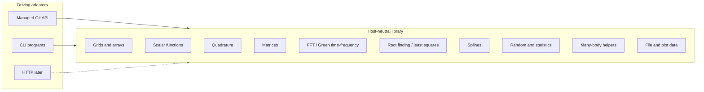

# Domain Model: SciFortran numerical library (C# port)

**Source material:**
- `docs/PURPOSE.md` (whole-library POC)
- `src/SCIFOR.f90` public facade at `e586903`
- `docs/modernization/behavior-catalog.md`
- ADRs 001–005
- First recovered subdomain: BEH-001 `linspace`

**Date:** 2026-08-19
**Status:** Draft (library-wide bounded contexts; linspace recovered in detail)

---

## 1. Purpose alignment

The purpose is to re-host the retained SciFortran library in C# so numerical jobs keep their legacy meaning: generate grids, evaluate functions, integrate, invert and diagonalize matrices, transform Green functions, optimize, interpolate, sample, and (as adapters) drive the existing CLI jobs. This model names the bounded contexts required to plan that port. It does not model ASP.NET, MPI, or missing plot/FFT backends. See `docs/PURPOSE.md` and ADR-005.

## 2. Ubiquitous language

| Term | Definition | Accepted aliases | Do not use | Source |
|------|------------|------------------|------------|--------|
| SciFor library | The retained public numerical capability formerly imported via `use SCIFOR` | managed port, C# library | “ASP.NET app” as the product | `src/SCIFOR.f90`; ADR-004 |
| Port | Host-neutral application service for one retained Fortran public procedure or cohesive family | use case | HTTP endpoint as the domain | ADR-002, ADR-005 |
| Driving adapter | Something that invokes a port (managed API now; CLI later; HTTP optional) | CLI adapter | “the Fortran program is the domain” | ADR-005 |
| Linear sequence | Ordered evenly spaced real samples over an interval | `linspace` result | Fortran `array(num)` as a product noun | BEH-001 |
| Start / Stop / Length | Inclusive-grid request fields | `start`, `stop`, `num` | CLI-only `wmin`/`L` as library defaults | BEH-001 |
| Domain failure | Call rejected instead of returning a result | legacy `error`/`STOP` | HTTP status as the domain concept | ADR-002 |
| Probe baseline | Accepted POC oracle revision and environment | `e586903` probe | “production SciFortran release” | ADR-001, ADR-005 |

## 3. Bounded contexts

| Context | Meaning | Legacy module(s) | First catalog IDs |
|---------|---------|------------------|-------------------|
| Grids and arrays | Inclusive/log/integer/power meshes, sort/shift, derivatives | `TOOLS` | BEH-001–BEH-005, BEH-010 |
| Scalar functions | Fermi, step, sign, Faddeeva | `FUNCTIONS` public exports | BEH-003, BEH-020 |
| Quadrature | Trapezoid/Simpson, Kramers–Kronig | `INTEGRATE` | BEH-030 |
| Matrices | Inverse, eigen, linear solve | `MATRIX` | BEH-040 |
| Transforms | FFT and imaginary-time/frequency maps | `FFTGF` (NR) | BEH-050 |
| Optimization | Broyden, Brent, MINPACK facades | `OPTIMIZE` | BEH-060 |
| Splines | Linear/cubic/poly interpolation | `SPLINE` | BEH-070 |
| Random and statistics | Sampling, histogram, moments | `RANDOM`, `STATISTICS` | BEH-080 |
| Many-body helpers | Green-function types, Padé, square lattice, Bethe DOS | `GREENFUNX`, `PADE`, `SQUARE_LATTICE`, Bethe in `TOOLS` | BEH-090 |
| File and plot data | Paths, gzip, `splot`/`sread` payloads | `IOTOOLS` | BEH-100 |
| CLI adapters | Process arguments and streams over the ports above | `numutils/src/*` | BEH-200+ |

## 4. Data dictionary (recovered subdomain)

First recovered entities remain those of BEH-001. Other contexts get dictionaries during their `/document-legacy` slice.

| Field | Owner entity | Type / format | Required? | Constraints | Source |
|-------|--------------|---------------|-----------|-------------|--------|
| `LinearSequenceRequest.start` | LinearSequenceRequest | binary64 | Yes | Unconstrained in recovered code | BEH-001 |
| `LinearSequenceRequest.stop` | LinearSequenceRequest | binary64 | Yes | Unconstrained in recovered code | BEH-001 |
| `LinearSequenceRequest.length` | LinearSequenceRequest | integer count | Yes | Inclusive default requires `>= 2`; `< 0` is a domain failure | BEH-001 |
| `LinearSequence.samples` | LinearSequence | ordered binary64 list | Yes on success | FIX-001: exact `0,0.25,0.5,0.75,1` | FIX-001; ADR-003 |

## 5. Core entities (recovered)

### LinearSequenceRequest / LinearSequence

Unchanged from the 2026-08-19 linspace recovery: value objects, no persistence, inclusive formula, typed domain failure instead of `STOP`. See BEH-001.

Library-wide entities (Matrix, Transform, Histogram, …) are **TBD per slice** and must not be invented here.

## 6. Relationships

| Relationship | Cardinality | Notes | Source |
|--------------|-------------|-------|--------|
| LinearSequenceRequest → LinearSequence | one-to-one on success | First recovered job | BEH-001 |
| CLI adapter → library port | many adapters, one arithmetic | CLI must not reimplement grids/FFT | ADR-005 |

## 7. Aggregates / consistency boundaries

| Boundary | Protects | External interactions |
|----------|----------|----------------------|
| Linear sequence evaluation | Inclusive formula and length rules | Managed API; later `linspace` CLI |
| Each later module port | That module’s public contract | Managed API and matching CLI |

Process-global `COMMON_VARS` / RNG state is an adapter or domain-service concern (GAP-002, GAP-015); it is not an aggregate in this draft.

## 8. Domain events (recovered)

| Event | When | Source |
|-------|------|--------|
| LinearSequenceProduced | Evaluation succeeds | BEH-001 |
| LinearSequenceRejected | Length/endpoint rule fails | BEH-001; mapping TBD in `/refine-feature` |

## 9. Open modeling questions

Library-wide (do not block `/refine-feature` on BEH-001):

- [ ] Canonical C# names: keep Fortran identifiers (`linspace`, `fftgf`) as aliases, or rename to ubiquitous-language types only?
- [ ] How is process-global RNG/timer/diagnostic state exposed without ASP.NET request races?
- [ ] Which MATRIX/FFT results require order/sign canonicalization?

First-slice (block `/refine-feature` on BEH-001, not library planning):

- [ ] Expose `includeStart` / `includeStop` / `step` on the first managed port?
- [ ] Decreasing intervals and `start == stop` now or later?
- [ ] Domain-failure vocabulary vs leftover `N<0` / `N<2` strings?

## 10. Tensions / conflicts

- CLI defaults (e.g. `linspace` `wmin=-5`) are not library defaults. Library ports require explicit arguments; CLI adapters apply CLI defaults. `E3`
- `FUNCTIONS` comments list a huge special-function collection, but the module’s public list is six names. The catalog follows **public exports**, not the include file. ADR-005.
- Fidelity `arange-5` is a driver loop, not library `arange`. BEH-005 stays T3 until a real `arange` capture exists.

## 11. Links

- Purpose: `docs/PURPOSE.md`
- Catalog: `docs/modernization/behavior-catalog.md`
- Migration plan: `docs/modernization/migration-plan.md`
- ADRs: ADR-001–005
- Behavior: `docs/modernization/behaviors/BEH-001-linspace.md`

---

*Updated: 2026-08-19 | Whole-library bounded contexts added; linspace subdomain retained | Plan: SL-001–SL-025*
