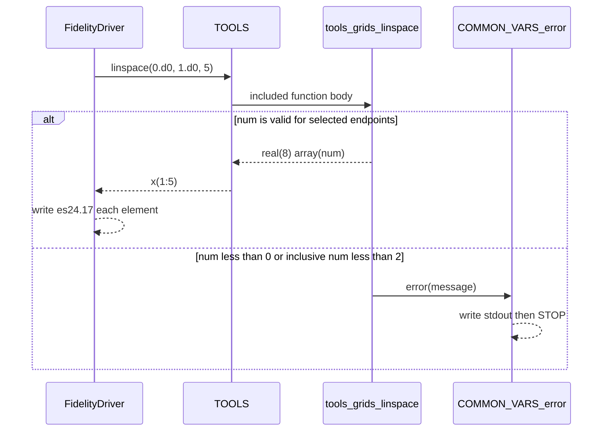
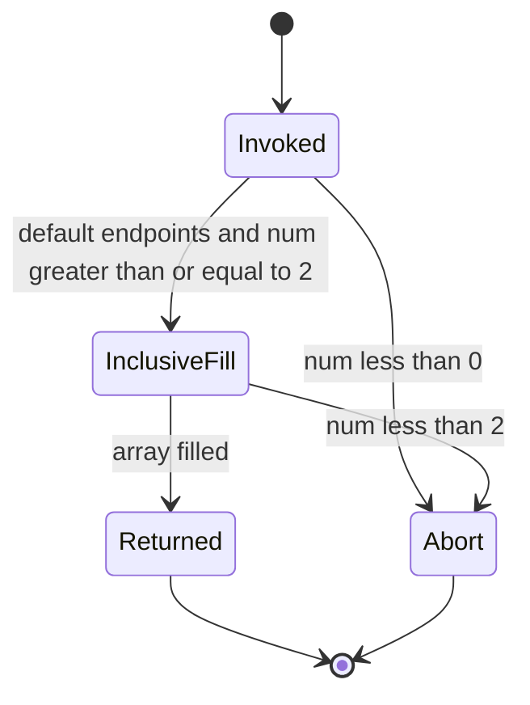

# Legacy Flow: Library linspace evaluation

**Behavior:** `BEH-001`
**Legacy surface:** `TOOLS.linspace` via fidelity driver (library call). CLI `linspace` is out of first-slice scope.
**Evidence grade:** `E1 verified` for the FIX-001 path; `E3 code-derived` for unexecuted branches
**Date:** `2026-08-19`

---

## 1. Scope

Trace `linspace` from the fidelity-driver call that produced `CAP-20260810-LINSPACE` through `TOOLS` into `tools_grids.f90` and back to the caller's array. Out of scope: CLI argument parsing, Fortran formatted stdout as a product contract, BLAS/FFT, and other fidelity sections.

---

## 2. Sequence diagram

---

## 3. Step trace

| Step | Legacy location | Action | Data in/out | Evidence grade | Notes |
|------|-----------------|--------|-------------|----------------|-------|
| 1 | `fidelity/driver.f90:12-14` | Set `n=5`, allocate `x(n)` | `n=5` | E1 / E3 | Probe path |
| 2 | `fidelity/driver.f90:15` | Call `linspace(0.d0, 1.d0, n)` | start=0, stop=1, num=5; optional args absent | E1 / E3 | Defaults include both endpoints |
| 3 | `src/TOOLS.f90:18,161` | Resolve public `linspace` via include | n/a | E3 | No extra wrapping |
| 4 | `src/tools_grids.f90:7-9` | Reject `num<0`; set `startpoint_`/`endpoint_` defaults true | flags true | E3 | `num<0` not taken in probe |
| 5 | `src/tools_grids.f90:11-14` | Compute `step=(1-0)/(5-1)=0.25`; fill `array(i)=0+(i-1)*step` | `[0,0.25,0.5,0.75,1]` | E1 values / E3 formula | Matches FIX-001 |
| 6 | `src/tools_grids.f90:29` | Assign `mesh` if present | not present | E3 | Skipped |
| 7 | `fidelity/driver.f90:16-19` | Print each value with `es24.17` | stdout section hashed `dabd07f9…` | E1 | Text format is probe capture, not managed-API contract |
| 8 | `src/COMVARS.f90:189-199` | Abort path only | process stop | E3 | Not taken |

---

## 4. State transitions

The function is otherwise stateless: no module globals are read or written in `linspace` itself. `error()` consults `mpiID` before printing. `E3` — `src/tools_grids.f90:1-30`; `src/COMVARS.f90:59-61,189-199`.

---

## 5. Unrecoverable or ambiguous regions

| Region | Why ambiguous | Impact | Required decision |
|--------|---------------|--------|-------------------|
| `src/tools_grids.f90:1-3` vs `:7` | Result `array(num)` is declared before `num<0` is checked | Negative `num` may be processor-dependent before `error` | DEF-002 |
| `istart`/`iend` false combinations | Not executed; four spacing rules exist in source | First-slice parity must not claim these branches | Defer or add fixtures |
| `mesh` output | Optional argument never passed in probe | Managed port may omit it | Owner: include or defer |
| CLI `RANGE` parser | `scan` for colons; empty-field reads; not run | Irrelevant to managed API slice | Keep out of BEH-001 |
| Capture bytes | Probe deleted stdout files; only hash + parsed values remain | Cannot byte-compare Fortran format | ADR-003 uses parsed equality |

---

## 6. Port implications

| Implication | Affected artifact | Evidence |
|-------------|-------------------|----------|
| Host-neutral port should accept start, stop, and length and return a sequence | ADR-002, `docs/DOMAIN.md` | E1 FIX-001; E3 signature |
| Endpoint flags are real legacy parameters but unproven; do not silently drop or invent them in the first managed signature without a decision | BEH-001 open questions | E3 `src/tools_grids.f90:4-27` |
| Abort is process-global `STOP`, not an error code; managed API must use a typed failure instead of mimicking `STOP` | ADR-002, GAP-026 | E3 `src/COMVARS.f90:189-199` |
| No BLAS/FFT/file dependency on this path | DEP-012–018 not required for BEH-001 | E3 `src/tools_grids.f90`; E1 probe |

---

## 7. Links

- Behavior: `docs/modernization/behaviors/BEH-001-linspace.md`
- Translation gaps: `docs/modernization/translation-gaps.md` (GAP-008, GAP-019, GAP-026)
- Oracle: `docs/modernization/oracle.md`
- Fixture: `docs/modernization/fixtures/FIX-001-linspace-5.md`

*Created: 2026-08-19*
