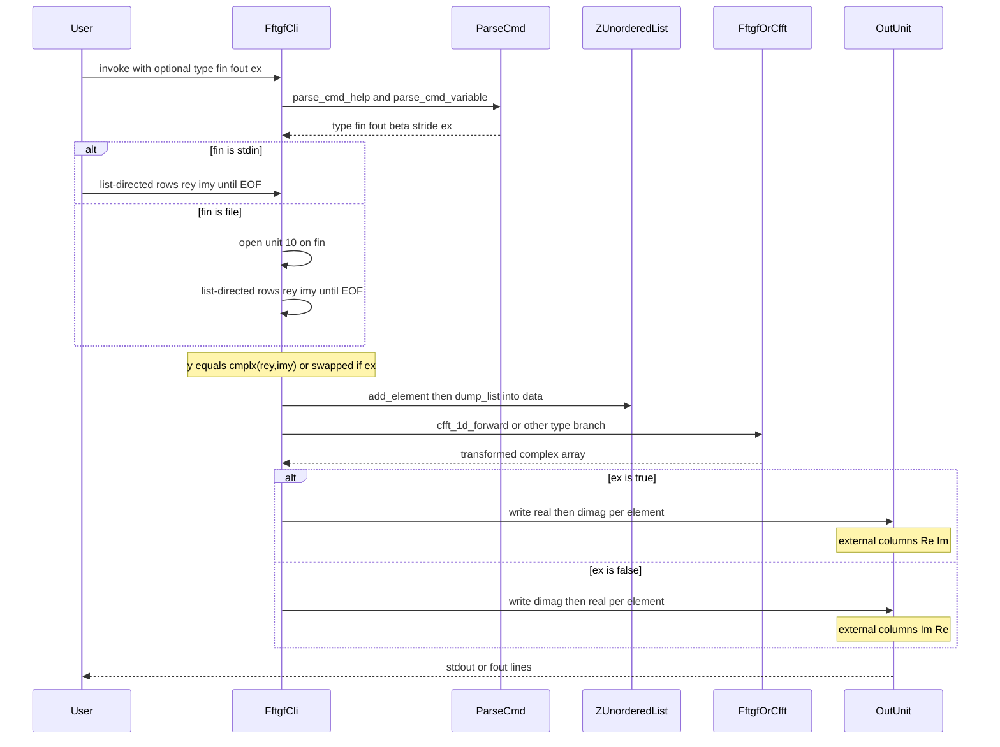
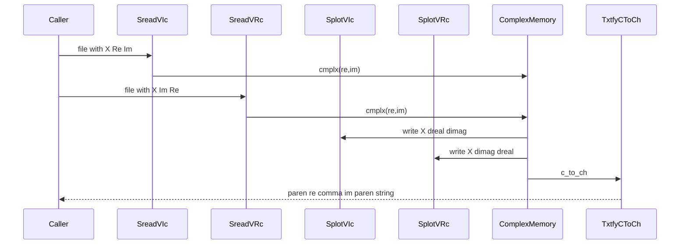
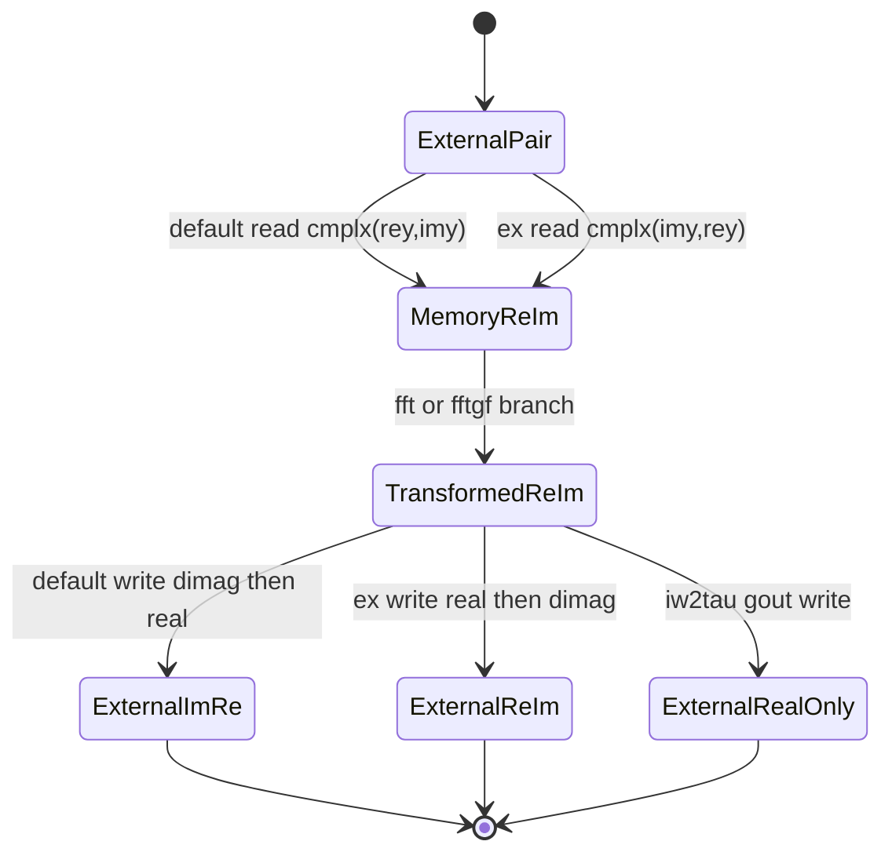

<!-- Legacy flow contract:
- Trace one behavior or entrypoint through legacy code and observable effects.
- Mark unrecoverable regions explicitly.
- Use Mermaid diagrams without custom styling.
-->

# Legacy Flow: `fftgf` complex-column I/O (`(Re,Im)` vs `(Im,Re)`)

**Behavior:** `BEH-304`
**Legacy surface:** `fftgf` CLI (primary); annotations for `ffcmplx`, `SLREAD`/`SLPLOT` complex overloads, `COMMON_VARS` `txtfy`
**Evidence grade:** `E3 code-derived` (help strings `E2 documented`; no `E1` asymmetric complex-column capture; secondary `ffcmplx` resolve path `E5 unknown`)
**Date:** `2026-08-10`

---

## 1. Scope

**In scope**

- Highest-risk observable path for BEH-304: `fftgf` from help/args → stdin or file two-column read → in-memory `complex(8)` → FFT/`fftgf_*` transform → default vs `ex=T` two-column write to stdout/file.
- Secondary annotations where the same external column contract splits: `ffcmplx` help/`ex`/`sread` call site; `sread`/`splot` integer-X vs real-X complex overloads; `txtfy`/`c_to_ch` diagnostic `(re,im)` strings; matrix-reader anomalies that affect any shared IOTOOLS codec story.

**Out of scope**

- FFT mathematical correctness, backend choice (NR/FFTW/MKL), normalization, and sign conventions (GAP-011 / BEH for FFT content).
- Exact list-directed byte formatting, locale, NaN/Infinity spelling (BEH-303 / GAP-007) except where column *order* is decided.
- Target architecture, host (CLI vs HTTP), or a single repository-wide codec choice.

**Legacy baseline:** `/Users/philipteitel/code/ADD-migrations/sci-fortran-legacy` at `e586903a26cc50ca8942f20ca3bccbd8814e6252` (read-only).

---

## 2. Sequence diagram

Primary recoverable path for default `type=fw` (same column write rules apply to `bw`, `rt2rw`, `rw2rt`, and `tau2iw` complex egress; `iw2tau` emits real scalars only).

Secondary contract split (not one continuous executable path; overload-dependent):

---

## 3. Step trace

### 3.1 Primary: `fftgf`

| Step | Legacy location | Action | Data in/out | Evidence grade | Notes |
|------|-----------------|--------|-------------|----------------|-------|
| 1 | `numutils/src/fftgf.f90:23-49` | Emit help buffer: input described as Fortran cmplx `(re,im)`; `ex` documented to exchange Real and Imag in both input and output | Help text to user via `parse_cmd_help` | `E2 documented` | Product-facing claim of `(re,im)` input and bidirectional `ex` |
| 2 | `numutils/src/fftgf.f90:51-57` | Parse `TYPE`, `FIN`, `FOUT`, `BETA`, `STRIDE`, `EX` (default `ex=.false.`) | CLI args → locals | `E3 code-derived` | `STRIDE` is parsed and never referenced later in this file (`E3` unused control) |
| 3 | `numutils/src/fftgf.f90:59-65` | Select stdin unit 5 or open file on unit 10 | Path/stream → `iunit` | `E3 code-derived` | Ingress host surface (GAP-020) |
| 4 | `numutils/src/fftgf.f90:67-79` | Loop `read(iunit,*,end=1)rey,imy`; build `y=cmplx(rey,imy,8)` or, if `ex`, `cmplx(imy,rey,8)`; accumulate via linked list; dump to `data(L)` | External columns → memory `(Re,Im)` components | `E3 code-derived` | **Default input:** first column → Re, second → Im. **`ex` input:** columns swapped into memory |
| 5 | `numutils/src/fftgf.f90:82-88` | Select stdout unit 6 or open `fout` on unit 20 | Egress unit | `E3 code-derived` | |
| 6a | `numutils/src/fftgf.f90:91-101` | `type=fw`: `cfft_1d_forward(data)` then write loop | Transformed `data(:)` → two reals/line | `E3 code-derived` | **Default write:** `dimag, real` ⇒ **(Im, Re)**. **`ex` write:** `real, dimag` ⇒ **(Re, Im)** |
| 6b | `numutils/src/fftgf.f90:103-113` | `type=bw`: same write order rules after `cfft_1d_backward` | Same as 6a | `E3 code-derived` | Column convention identical to `fw` |
| 6c | `numutils/src/fftgf.f90:116-133` | `type=rt2rw`: length checks, `fftgf_rt2rw`, `swap_fftrt2rw`, then same `ex`/default write order on `out` | Same column rules | `E3 code-derived` | FFT internals out of BEH-304 scope |
| 6d | `numutils/src/fftgf.f90:136-152` | `type=rw2rt`: even-length check, `fftgf_rw2rt`, `cfft_1d_ex`, same write order | Same column rules | `E3 code-derived` | |
| 6e | `numutils/src/fftgf.f90:155-163` | `type=iw2tau`: `fftgf_iw2tau` → write **real** `gout(i)` only | No complex columns on egress | `E3 code-derived` | Complex-column contract does not apply to this egress |
| 6f | `numutils/src/fftgf.f90:165-177` | `type=tau2iw`: real part of input used for transform; complex `out` written with same `ex`/default order | Same column rules on complex egress | `E3 code-derived` | Help says `tau2iw` needs real input (`:32-33`) while read path still consumes two columns (`:70-71`) — tension in §5 |
| 7 | `numutils/src/Makefile:8,40+` | `fftgf` is in default `all` target | Build inclusion | `E3 code-derived` | Contrast `ffcmplx` not in `all` |

**Observable column summary for `fftgf` (asymmetric Re≠Im required to detect):**

| Mode | External input columns | Memory after read | External complex output columns |
|------|------------------------|-------------------|---------------------------------|
| default `ex=F` | col1→Re, col2→Im | `(Re,Im)` | **Im, Re** |
| `ex=T` | col1→Im, col2→Re | `(Re,Im)` after swap | **Re, Im** |

Help text implies Fortran `(re,im)` columns and that `ex` exchanges both ends; default **output** is not `(re,im)` column order. `E2`/`E3` — `fftgf.f90:32,45,70-71,93-100`.

### 3.2 Secondary: `ffcmplx`

| Step | Legacy location | Action | Data in/out | Evidence grade | Notes |
|------|-----------------|--------|-------------|----------------|-------|
| A1 | `numutils/src/ffcmplx.f90:23-32` | Help claims default file form `X,imG,reG`; `ex=T` ⇒ `X,reG,imG` | Documented column order | `E2 documented` | Aligns with real-X `sreadV_RC`/(Im,Re) default, not with `fftgf` default input |
| A2 | `numutils/src/ffcmplx.f90:34-39` | Parse `L`, `N`, `FIN`, `FOUT`, `EX` | `ex` local set | `E3 code-derived` | |
| A3 | `numutils/src/ffcmplx.f90:41-50` | Size file; `allocate(wm(L),Gread(N,L))`; `call sread(trim(fin),Gread,wm)` | Intended complex matrix + X vector | `E3 code-derived` / resolve `E5 unknown` | Argument order is `(fin, complex(:,:), real(:))`. Contrasting `pade` uses `sread(fin,wm,gm)` = `(fin, real(:), complex(:))` matching `sreadV_RC` (`numutils/src/pade.f90:59`; `src/SLREAD.f90:13-21`; `src/slread_sread_M.f90:181-187`). No inspected generic matches `(char, complex(:,:), real(:))` |
| A4 | `numutils/src/ffcmplx.f90:39,50` | `ex` never referenced after parse | Documented swap unused | `E3 code-derived` | Help/code tension |
| A5 | `numutils/src/ffcmplx.f90:52-55` | `rm -f fout`; `splot(fout,wm,abs(G),phase(G),append=.true.)` | Abs/phase reals, not complex columns | `E3 code-derived` | Complex order matters only via what `sread` loaded into `Gread` |
| A6 | `numutils/src/Makefile:8,24-26` | `ffcmplx` target exists; omitted from `all` | Not default-built | `E3 code-derived` | Support/scope decision still open (GAP-019) |

### 3.3 Secondary: `SLREAD` / `SLPLOT` vector complex overloads

| Step | Legacy location | Action | Data in/out | Evidence grade | Notes |
|------|-----------------|--------|-------------|----------------|-------|
| B1 | `src/slread_sread_V.f90:108-134` | `sreadV_IC`: read `X, re, im` then `cmplx(re,im)` | External **(Re, Im)** | `E3 code-derived` | Integer-X path |
| B2 | `src/slread_sread_V.f90:246-272` | `sreadV_RC`: read `X, im, re` then `cmplx(re,im)` | External **(Im, Re)** | `E3 code-derived` | Real-X path; matches `ffcmplx` help default narrative |
| B3 | `src/slplot_splot_V.f90:130-146` | `splotV_IC`: write `X, dreal, dimag` | External **(Re, Im)** | `E3 code-derived` | Symmetric with B1 |
| B4 | `src/slplot_splot_V.f90:285-301` | `splotV_RC`: write `X, dimag, dreal` | External **(Im, Re)** | `E3 code-derived` | Symmetric with B2 |

### 3.4 Secondary: matrix `sread` anomalies (shared codec risk)

| Step | Legacy location | Action | Data in/out | Evidence grade | Notes |
|------|-----------------|--------|-------------|----------------|-------|
| C1 | `src/slread_sread_M.f90:82-99` | `sreadM_IC` else-branch allocates only `reY` but reads `imY(...)`; formatted `Y2` branch reads `imY(2)` twice instead of `reY(2)` (`:87`) | Undefined / corrupted second-component path | `E3 code-derived` | Latent defect vs unreachable — undecided |
| C2 | `src/slread_sread_M.f90:190-207` | `sreadM_RC` same allocation gap in else-branch; formatted `Y2` duplicates `imY(2)` (`:195`) | Same class of anomaly | `E3 code-derived` | List-directed single-Y path uses **(Im, Re)** tokens into `imY,reY` |
| C3 | Contrast B1 vs C1 | Vector IC uses `(Re,Im)`; matrix IC list-directed else uses `(Im,Re)` tokens | Overload family not one convention | `E3 code-derived` | Reinforces GAP-013 per-surface/per-overload requirement |

### 3.5 Secondary: `txtfy` diagnostic strings

| Step | Legacy location | Action | Data in/out | Evidence grade | Notes |
|------|-----------------|--------|-------------|----------------|-------|
| D1 | `src/COMVARS.f90:82-84,275-283` | `txtfy` → `c_to_ch`: `re=real(c); im=aimag(c)`; string `"("//re//","//im//")"` | Always **(re,im)** text | `E3 code-derived` | Differs from default `fftgf`/`splotV_RC` file columns |

---

## 4. State transitions

Column-order state for a complex value as it crosses the `fftgf` boundary (memory always Fortran intrinsic components).

---

## 5. Unrecoverable or ambiguous regions

| Region | Why ambiguous | Impact | Required decision |
|--------|---------------|--------|-------------------|
| `fftgf` help `(re,im)` vs default writer `(Im,Re)` | Documented claim conflicts with coded default egress | Parity cannot treat help and stdout as one contract | Defect disposition: `reproduce-faithfully` vs `fix-*` for default output order; per-surface codec ADR (GAP-013) |
| Default `fftgf` input `(Re,Im)` vs default output `(Im,Re)` | Asymmetric ends on same CLI | Round-trip without `ex` swaps columns | Whether asymmetry is intentional compatibility or defect |
| `fftgf` `tau2iw` help (real input) vs two-column read | Help and reader disagree | Unknown intended file shape for that type | Owner clarifies accepted input arity for `tau2iw` |
| `fftgf` `STRIDE` | Parsed, never applied in `fftgf.f90` | Documented option appears inert | Treat as dead help, missing feature, or out-of-scope |
| `ffcmplx` `sread(fin,Gread,wm)` generic resolve | No matching procedure signature in inspected `SLREAD` interface; not executed | Unknown whether utility builds or what columns it would load | Build/run on accepted compiler, or retire surface (GAP-019/020) |
| `ffcmplx` unused `ex` | Help documents swap; body ignores flag | Cannot claim documented `ex` behavior | Dead help vs broken feature vs unsupported utility |
| `sreadM_IC` / `sreadM_RC` unallocated `imY` and duplicate `imY(2)` reads | Source appears incorrect; reachability/compiler outcome unknown | Shared IOTOOLS codec may be unsafe for matrix complex paths | Defect ledger + execute or prove unreachable |
| Exact list-directed bytes for `fftgf` columns | No `E1` capture; formatting is BEH-303/GAP-007 | Column *order* recoverable; byte goldens not | Oracle fixtures with asymmetric Re≠Im under accepted locale/compiler |
| CLI not in scoped oracle T1 | Oracle executed core/fidelity only; CLIs not built | No verified `fftgf` golden yet | Capture when CLI enters retained slice |

---

## 6. Port implications

Implications are evidence for Migration Strategist / Architect — **no target design is chosen here**.

| Implication | Affected artifact | Evidence |
|-------------|-------------------|----------|
| Each retained surface needs a **named** complex-column codec; a global `(Re,Im)` or `(Im,Re)` default would change some observables | GAP-013; future ADR external data contracts; REQ/DOMAIN for BEH-304 | `E2`/`E3` — this flow §§3.1–3.5; `translation-gaps.md` GAP-013 |
| `fftgf` list-directed two-column stream is a CLI text boundary separate from HTTP/DTO mapping | GAP-007, GAP-020 | `E3` — `fftgf.f90:70-71,93-113` |
| Help-vs-writer and unused-`ex` contradictions are **retired with evidence**, not dispositioned — no implementation may describe them as fixed | `defect-ledger.md` DEF-301–304, DEF-312–313 (retired, ADR-006/007) | `E2`/`E3` — BEH-304 tensions; ASSESSMENT complex-column conflict |
| Abs/phase `ffcmplx` egress is not a complex-column writer; risk is mis-parsed input complex | GAP-013, GAP-019 | `E3` — `ffcmplx.f90:50-55` |
| Diagnostic `txtfy` `(re,im)` must not be assumed equal to file/CLI column order | GAP-013; BEH-303 adjacency | `E3` — `COMVARS.f90:275-283` vs `splotV_RC` |
| Ordering of *pairs* is column semantics (GAP-013), distinct from sort/eigenpair ordering (GAP-014) | GAP-014 only if consumers sort complex keys | `E4` inferred separation — do not conflate without evidence |
| Process termination / stdout mixing on CLI errors remains adjacent (count mismatch `abort`, dimension `error`) | GAP-026, BEH-305 | `E3` — `fftgf.f90:77,118,138` |
| Asymmetric Re≠Im fixtures are mandatory before accepting any codec | Oracle §7; GAP-013 verification strategy | `E4`/`E5` — no E1 complex-column capture yet |

---

## 7. Links

- Behavior: `docs/modernization/behaviors/BEH-304-complex-column-ordering.md`
- Related behavior (format adjacency): `docs/modernization/behaviors/BEH-303-numeric-text-formatting.md`
- Translation gaps: `docs/modernization/translation-gaps.md` — GAP-007, GAP-013, GAP-014 (ordering family, not pair-swap), GAP-020, GAP-026
- Oracle: `docs/modernization/oracle.md` (CLI/`fftgf` outside scoped T1; complex-column fixtures still open)
- Assessment stop: `docs/modernization/ASSESSMENT.md` §9 complex-column conflict
- Defect ledger: `docs/modernization/defect-ledger.md` — DEF-301–307, DEF-312–313 (all **retired with evidence**, ADR-006/007); contradictions in §5 map to those IDs

**Scope note (2026-08-19):** `fftgf` is retired from build scope (ADR-006) and external complex-column order is an adapter concern (ADR-007). This flow is retained as **legacy characterization** and as the evidence behind the retired rows. It does not describe target behavior.

### Tensions / conflicts

- **`fftgf` help vs default writer:** help describes Fortran `(re,im)`; default write is `dimag,real`. `E2`/`E3` — `numutils/src/fftgf.f90:32,97-100`.
- **`fftgf` input vs output asymmetry:** default read builds `cmplx(rey,imy)`; default write prints `(Im,Re)`. `E3` — `fftgf.f90:70-71,97-100`.
- **`ex` meaning:** help says exchange in input *and* output; coded path swaps on read into memory and selects the opposite write order — effective external round-trip semantics need fixture confirmation (`E5` until executed).
- **`ffcmplx` help vs code:** `ex` documented, unused; `sread` argument order vs `pade` / `sreadM_RC` signature unresolved. `E2`/`E3`/`E5`.
- **`SLREAD`/`SLPLOT` overload split:** integer-X vector complex `(Re,Im)`; real-X vector complex `(Im,Re)`. `E3`.
- **`txtfy` always `(re,im)`** vs several file/CLI `(im,re)` writers. `E3`.
- **Matrix vs vector IC column order** and matrix allocation/format anomalies. `E3`.

*Created: 2026-08-10*
