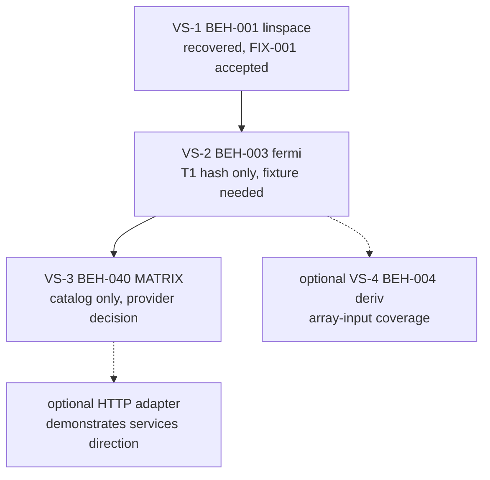

<!-- Migration plan contract:
- Sequence every retained catalog ID. Retired surfaces are listed, not scheduled.
- Catalog-only rows are document → refine → design → implement, not implementation-ready stories.
- Do not invent C# signatures, namespaces, NuGet IDs, or solution layout.
- Per-slice `/refine-feature` precedes design. Library-wide architecture is already in ADR-002/005/007.
- If a section has no content yet, write `None yet.`.
-->

# Migration Plan: SciFortran C# port (ADD demonstration POC)

**Legacy revision:** `e586903a26cc50ca8942f20ca3bccbd8814e6252`
**Target stack:** C# / .NET 8 hexagonal managed API; no CLI adapters (ADR-006); HTTP optional
**Date:** `2026-08-19`
**Status:** Accepted for sequencing (rescoped 2026-08-19)
**Strategy:** strangler, scoped to representative vertical slices
**Structure fidelity:** preserve-then-refactor
**Defect policy:** reproduce-then-refactor
**Authority:** ADR-004, ADR-005, ADR-006, ADR-007, ADR-008, `docs/modernization/behavior-catalog.md`

This plan sequences code production. It does not authorize implementation-ready stories except where a slice has completed `/refine-feature`. It does not claim T1 parity outside recovered fixtures.

---

## 1. Executive summary

The objective is a proof of concept that **Artifact-Driven Development extends to migration** (`docs/PURPOSE.md`). The C# library is the artifact that demonstrates the method, not a SciFortran replacement.

Accordingly this plan builds **three vertical slices**, each carried end to end through the full ADD loop, rather than the twenty-five slices sequenced in the 2026-08-19 original:

| Slice | Behavior | Prior ID | Why it is in the built set |
|-------|----------|----------|-----------------------------|
| **VS-1** | `BEH-001` `TOOLS.linspace` | SL-001 | Oracle already settled (`FIX-001`, ADR-001/003). Proves the pipeline with no argument about the baseline. |
| **VS-2** | `BEH-003` `FUNCTIONS.fermi` | SL-005 | T1 evidence exists but **no fixture recovered**. Exercises `/document-legacy` and fixture capture for real. |
| **VS-3** | `BEH-040` `MATRIX` | SL-011 | No T1 evidence; needs BLAS/LAPACK decided behind a numeric port. The hard case, and the one a skeptical client asks about. |

Everything else retained by ADR-005 §3 stays catalogued as **reserve** — available, not planned. The CLI surface is retired from build scope (ADR-006). File I/O, CLI parsing, timing, and console diagnostics are adapters, not ported modules (ADR-007).

Only **VS-1** is recovered enough to start requirements. VS-2 and VS-3 need `/document-legacy` and fixture capture first.

**Next ADD command:** `/refine-feature` against `docs/modernization/behaviors/BEH-001-linspace.md`.

---

## 2. Strategy selection

| Option | Decision | Why |
|--------|----------|-----|
| strangler, demonstration-scoped | **Selected** | Each slice adds ports for one family and is independently completable. Scoping to three keeps every slice's artifact trail complete, which is the deliverable. |
| strangler, whole library | Rejected 2026-08-19 | Fifteen slices for a POC nobody ships; diminishing methodological return after the third (ADR-008). |
| phased-rewrite by technical layer | Rejected | Would delay a callable port behind an I/O or hosting layer the legacy library does not have. |
| big-bang parallel run | Rejected | No production Fortran service to dual-run; Fortran ABI is not retained. |

**How strangler applies here:** there is no HTTP façade in front of `libscifor.a`. The growing "new system" is the managed C# library. Unbuilt families simply do not exist in C#, and the demonstration does not pretend otherwise.

**Preserve-then-refactor:** reproduce accepted legacy results (and recorded defects) at the port first. Do not silently "fix" unexecuted branches. Refactor after parity for that slice is accepted.

**Solution layout, type names, and DI** are VS-1 design work after `/refine-feature` (ADR-002 explicit non-decisions). This plan does not invent them.

---

## 3. Per-slice ADD loop

Every slice except VS-1 starts with recovery. Skip a step only when its artifact already exists.

| Step | Command / activity | Exit criterion |
|------|--------------------|----------------|
| 1. Recover | `/document-legacy` | BEH file, flow, fixtures/captures, DEF rows for contradictions on that surface |
| 2. Requirements | `/refine-feature` | Implementation-ready stories; open questions closed or explicitly deferred |
| 3. Design | slice design (after refine) | Port signatures, types, test list, adapter mapping; no new product-scope decisions |
| 4. Implement | C# behind hexagonal ports | Stories for that slice; FIX/captures pass their comparison rules |
| 5. UAT | parity against accepted fixtures | No claim beyond recovered evidence |

Catalog-only rows **must not** jump to design or C#. T1 hash-only rows still need `/document-legacy` to recover parsed values; hashes alone are not FIX records.

Because the artifact trail *is* the deliverable, a slice is not complete when its code passes. It is complete when every step above has a recorded artifact and no step rests on assertion alone.

---

## 4. Built slice sequence

| Slice | Behaviors | Status now | Next command | Implementation-ready? |
|-------|-----------|------------|--------------|------------------------|
| VS-1 | `BEH-001` `linspace` | Recovered; `FIX-001` accepted | `/refine-feature` | **No** until refine closes first-slice questions |
| VS-2 | `BEH-003` `fermi` | T1 hash only; no parsed fixture | `/document-legacy` | No |
| VS-3 | `BEH-040` `MATRIX` (inverse, diagonalize, solve) | Catalog-only; no T1 evidence | `/document-legacy` | No |
| VS-4 *(optional)* | `BEH-004` `deriv` | T1 hash only; 1,024-row capture not retained | `/document-legacy` | No |

VS-3 may be swapped for `BEH-050` `FFTGF` if complex-valued transforms suit the audience better (ADR-008 §5). Do not build both.

---

## 5. Slice notes

### VS-1 — `BEH-001` `linspace`

The only slice whose oracle is settled. `FIX-001` requires exact parsed equality with `0, 0.25, 0.5, 0.75, 1` (ADR-003). `DEF-001` is dispositioned: reproduce the probe parsed values, not the Python-generated golden file.

Open at refine: whether to expose `includeStart`/`includeStop`/`step`; decreasing intervals and `start == stop`; domain-failure vocabulary for the `N<0` / `N<2` paths (`DEF-002` still open).

This slice also establishes solution layout, the first port signature, and the typed-domain-failure pattern that VS-2 and VS-3 reuse. Its design cost is therefore higher than its arithmetic suggests, and that is expected.

### VS-2 — `BEH-003` `fermi`

The fidelity corpus contains a `fermi-beta100` section (five two-column rows over `[-2,-1,0,1,2]`), but only as a hash. `/document-legacy` must recover parsed values into a FIX record before refine. Comparison rule is exact parsed equality once recovered (ADR-005 §7), not profile `1e-6`.

This is the slice that demonstrates recovery and fixture capture, which VS-1 cannot because its fixture already exists.

### VS-3 — `BEH-040` `MATRIX`

The load-bearing slice. `matrix_inverse*`, `m_invert*`, `matrix_diagonalize`, `solve_linear_system`; catalog-only, no executed evidence, and dependent on the probe-linked OpenBLAS 0.3.34 behavior.

Three things must happen here that no earlier slice forces:

1. **Fixture capture from scratch.** No T1 evidence exists. Captures must come from a contained re-run of the probe recipe; do not run build or fidelity scripts against the read-only legacy checkout.
2. **A numeric contract ADR** in the shape of ADR-003, covering conditioning, eigenvalue ordering and sign conventions, and the comparison rule (residual versus elementwise — elementwise equality is unlikely to be the right rule here).
3. **A provider decision behind the numeric port.** Managed implementation or approved native wrapper, reproducing probe-linked OpenBLAS behavior. Do not copy `mkl_lapack.fi` or vendored sources into the target tree (ADR-005 §6, GAP-010, DEP-012–018).

`BEH-302` array layout matters here in a way it does not for VS-1 or VS-2: Fortran column-major and leading-dimension conventions meet C# defaults at this port.

### VS-4 *(optional)* — `BEH-004` `deriv`

Cheap because T1 evidence exists, and it adds array-*input* coverage for the `BEH-302` layout contract. The 1,024-row `xy2.data` capture was not retained and must be recovered. Add only if array-shape contracts need demonstrating.

### Optional HTTP adapter

Not required. The services claim currently rests on inspecting the domain's independence from I/O and hosting. A thin HTTP adapter over an existing port would demonstrate it directly and is the closest artifact to a prospective client's actual ask. Tracked as an open purpose question, not a planned slice.

---

## 6. Reserve — retained but not planned

These keep their catalog entries and remain authorized by ADR-005 §3. **No story exists for them.** They are the breadth reserve if the demonstration needs more (ADR-008 §6).

| Catalog ID | Surface | Prior slice |
|------------|---------|-------------|
| BEH-002 | `TOOLS.logspace` | SL-002 |
| BEH-005 | `TOOLS.arange` | SL-003 |
| BEH-010 | `TOOLS` remaining grids, sort/uniq/shift; Bethe helpers; convergence checks | SL-004 / SL-014 |
| BEH-020 | `FUNCTIONS` remainder (`heaviside`, `step`, `sgn`, `wfun`, `zerf`) | SL-006 |
| BEH-030 | `INTEGRATE` | SL-009 |
| BEH-050 | `FFTGF` NR contract | SL-013 |
| BEH-060 | `OPTIMIZE` | SL-012 |
| BEH-070 | `SPLINE` | SL-008 |
| BEH-080 | `RANDOM` / `STATISTICS` | SL-010 |
| BEH-090 | `GREENFUNX`, `PADE`, `SQUARE_LATTICE` | SL-014 |
| BEH-100 | `IOTOOLS` data helpers | SL-015 |

**`BEH-100` changed shape.** Under ADR-007 it is no longer a module translation. If a built slice needs to hand results across a boundary, that is a driven port with an adapter, designed in that slice; the legacy `splot`/`sread` procedures are evidence of *what data* crossed the boundary, not a specification of bytes.

**`BEH-110` is dissolved,** not reserved. `PARSE_CMD` and `TIMER` are dropped; `COMMON_VARS` diagnostics split between typed domain failures (domain) and message/channel/styling (adapter). See ADR-007.

---

## 7. Retired (do not schedule C# stories)

| Surface | Authority |
|---------|-----------|
| All sixteen `numutils/src/` CLI programs (`BEH-200`–`BEH-216`) | ADR-006 |
| Managed expression evaluator for `func` / `libmatheval` | ADR-006 |
| Gnuplot wrapping for `splot` | ADR-006 |
| `PARSE_CMD` as library surface; `TIMER` as product surface | ADR-007 |
| Legacy file-format fidelity for `splot`/`sread` | ADR-007 |
| `vfplot` / DISLIN / `DLPLOT` | ADR-005 |
| FFTPACK FFT backend | ADR-005 |
| `CHRPACK` | ADR-005 |
| `bin/setup_sf.sh` as a product entrypoint | ADR-005 |
| Fortran `.mod` / `libscifor.a` ABI | ADR-005 |
| Unexported special-function internals | ADR-005 |
| MPI/OpenMP runtimes as operational requirements | ADR-005 |
| `ifort` / MKL / FFTW3 as required product providers | ADR-005 |

The CLI **catalog** (`behavior-catalog.md` §4) is retained as recovered evidence about library behavior. Retired means not built; it does not mean the documentation is discarded.

HTTP/ASP.NET is **not retired**; it is optional and out of this plan's required slices (GAP-028, RISK-010).

---

## 8. Oracle and comparison policy

| Scope | Rule |
|-------|------|
| VS-1 / `FIX-001` | Exact parsed equality (ADR-003). |
| VS-2 `fermi` | Exact parsed equality once the fixture is recovered; do not use profile `1e-6` (ADR-005 §7). |
| VS-3 `MATRIX` | **Undecided.** Requires its own numeric-contract ADR. Elementwise exact equality is unlikely to be appropriate; residual or tolerance-based rules must be argued from captured evidence. |
| Reserve surfaces | Profile `1e-6` is a **non-authoritative planning default** only; no parity is claimed. |
| Python goldens / copied `xy2.deriv` | Not E1. `DEF-001` pattern applies. |
| Global workflow `oracleTier` | Remains T3. Cite `FIX-001` / `oracle.md` for scoped T1. |

Contained re-runs of the probe recipe are in scope for recovering deleted parsed values. Do not run `scripts/build.sh` / `scripts/fidelity.sh` against the read-only legacy checkout (INT conflicts; DEP-008).

---

## 9. Risks

| Risk / gap | Affected slice | Planning default already on file |
|------------|----------------|----------------------------------|
| **VS-3 has no T1 fixture.** Capture is the most expensive step in the plan and the likeliest to slip | VS-3 | Contained probe re-run; no writes to the legacy checkout |
| **GAP-010 / DEP-012–018 matrix providers.** Now first-class work, not a later concern | VS-3 | Managed or native port reproducing OpenBLAS-linked probe behavior; no Intel headers |
| Eigenvalue ordering/sign and conditioning conventions are uncharacterized | VS-3 | Decide in the VS-3 numeric-contract ADR |
| `BEH-302` column-major and leading-dimension conventions meet C# defaults | VS-3 | Layout is a domain contract (ADR-007); decide at refine |
| RISK-011 silent defect fixes | Each slice's `/document-legacy` | Expand `docs/modernization/defect-ledger.md` before implement |
| 310 compiler warnings / warning-affected paths | Surfaces that use those routines | Characterize; do not "clean up" into different numbers |
| GAP-022 licensing for production | Any later production intent | Accepted for this private POC only (ADR-004) |
| Retired contradictions are closed but unresolved | Any future CLI or legacy-file interop | Reopen `DEF-301`–`DEF-313` before claiming compatibility |

GAP-015 (RNG sequence versus distribution) and GAP-013 (complex-column order) no longer sit on the critical path: `RANDOM` is reserve, and complex-column order is an adapter concern under ADR-007.

---

## 10. When design happens

Library-wide design already exists: hexagonal ports, managed API as the product, I/O and host concerns as adapters, probe baseline, retirements (ADR-002, ADR-005, ADR-006, ADR-007).

**Slice design starts after `/refine-feature` for that slice.** For VS-1 that is the next command. Design then chooses concrete C# names, project layout, and the first port signature — the items ADR-002 explicitly deferred.

Do not start a library-wide ASP.NET or NuGet packaging design in this command.

---

## 11. Next command

**`/refine-feature` on BEH-001** (`docs/modernization/behaviors/BEH-001-linspace.md`).

Do not start VS-2 or VS-3 implementation stories from this plan. After VS-1 C# exists and `FIX-001` passes, the next step is VS-2 `/document-legacy`.

---

## 12. Links

- Purpose / domain: `docs/PURPOSE.md`, `docs/DOMAIN.md`
- Assessment: `docs/modernization/ASSESSMENT.md`
- Catalog: `docs/modernization/behavior-catalog.md`
- Behavior: `docs/modernization/behaviors/BEH-001-linspace.md`
- Fixture: `docs/modernization/fixtures/FIX-001-linspace-5.md`
- Defects: `docs/modernization/defect-ledger.md`
- Oracle: `docs/modernization/oracle.md`
- Gaps / deps: `docs/modernization/translation-gaps.md`, `docs/modernization/dependency-ledger.md`
- ADRs: ADR-001–008 under `docs/decisions/`

---

*Created: 2026-08-19 | Command: `/plan-migration` | Rescoped 2026-08-19 to demonstration-first vertical slices per ADR-006/007/008*
