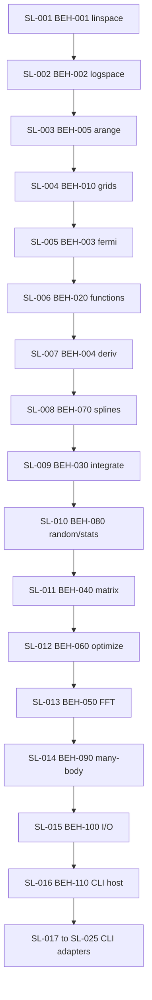

<!-- Migration plan contract:
- Sequence every retained catalog ID. Retired surfaces are listed, not scheduled.
- Catalog-only rows are document → refine → design → implement, not implementation-ready stories.
- Do not invent C# signatures, namespaces, NuGet IDs, or solution layout.
- Per-slice `/refine-feature` precedes design. Library-wide architecture is already in ADR-002/005.
- If a section has no content yet, write `None yet.`.
-->

# Migration Plan: SciFortran C# port (POC)

**Legacy revision:** `e586903a26cc50ca8942f20ca3bccbd8814e6252`
**Target stack:** C# / .NET 8 hexagonal managed API; CLI adapters over the same ports
**Date:** `2026-08-19`
**Status:** Accepted for sequencing
**Strategy:** strangler (grow the managed library surface family by family)
**Structure fidelity:** preserve-then-refactor
**Defect policy:** reproduce-then-refactor
**Authority:** ADR-004, ADR-005, `docs/modernization/behavior-catalog.md`

This plan sequences code production. It does not authorize implementation-ready port stories except where a slice has completed `/refine-feature` **and** `/plan-port-story`. It does not claim T1 parity outside recovered fixtures.

---

## 1. Executive summary

The product is a host-neutral C# port of the retained `SCIFOR` public surface plus buildable CLI adapters (ADR-004, ADR-005). Fortran ABI, `vfplot`/DISLIN/`DLPLOT`, FFTPACK, CHRPACK, and unexported special-function internals are out of product.

Work proceeds as a **strangler of the managed API**: each slice adds ports for one retained family. CLI programs are later driving adapters over those ports; they do not reimplement arithmetic. ASP.NET remains an optional later adapter and is not on the critical path.

Only **SL-001 (BEH-001)** has recovered behavior **and** a refined REQ. REQ-001 is `Draft` until the owner marks `Ready for Design`. Every other retained ID still needs `/document-legacy` (and, for T1 hash-only rows, recovered parsed fixtures) before `/refine-feature`.

**Next ADD command:** `/design-application` against `docs/requirements/REQ-001-linspace.md`, then `/plan-port-story` for SL-001.

---

## 2. Strategy selection

| Option | Decision | Why |
|--------|----------|-----|
| strangler | **Selected** | Assessment walking skeleton and catalog require module-by-module ports with per-slice recovery. Most surfaces are T3. |
| phased-rewrite by technical layer | Rejected | Would delay a callable linspace port behind a whole I/O or hosting layer that the legacy library does not have. |
| big-bang parallel run | Rejected | No production Fortran service to dual-run; this is a library port, not a live cutover. Fortran ABI is not retained. |

**How strangler applies here:** there is no HTTP façade in front of `libscifor.a`. The growing “new system” is the managed C# library. Unported families simply do not exist yet in C#. Callers of the POC use only completed ports.

**Preserve-then-refactor:** reproduce accepted legacy results (and recorded defects) at the port first. Do not silently “fix” unexecuted branches (PURPOSE; defect policy). Refactor after parity for that slice is accepted.

**Solution layout, type names, and DI** are SL-001 design work after REQ-001 (`/design-application`; ADR-002, ADR-004 explicit non-decisions). This plan does not invent them.

---

## 3. Per-slice ADD loop

Every slice except SL-001 starts with recovery. Skip a step only when its artifact already exists.

| Step | Command / activity | Exit criterion |
|------|--------------------|----------------|
| 1. Recover | `/document-legacy` | BEH file, flow, fixtures/captures, DEF rows for contradictions on that surface |
| 2. Requirements | `/refine-feature` | REQ file with `Sn` scenarios; open questions closed or explicitly deferred |
| 3. Design | `/design-application` then `/plan-port-story` | Port signatures, types, test list, adapter mapping; no new product-scope decisions |
| 4. Implement | C# behind hexagonal ports | Stories for that slice; FIX/captures pass their comparison rules |
| 5. UAT | parity against accepted fixtures | No claim beyond recovered evidence |

Catalog-only rows **must not** jump to design or C#. T1 hash-only rows (BEH-002–004) still need `/document-legacy` to recover parsed values; hashes alone are not FIX records.

---

## 4. Slice sequence

Dependency-light numeric ports first. Provider-heavy and I/O/CLI slices later. The catalog’s suggested order is kept except:

1. **BEH-010 is split.** Remaining grids/sort helpers stay with TOOLS (SL-004). Bethe DOS / lattice-adjacent TOOLS helpers **and TOOLS convergence checks** move with many-body (SL-014), because they are not required for `linspace`/`logspace`/`arange`.
2. **CLI adapters are a later wave**, not interleaved with SL-001. ADR-002 keeps the first driving adapter as the managed API. CLI text/locale/exit contracts (GAP-007, DEF-003, DEF-004) would otherwise stall the walking skeleton.
3. **BEH-110 is scheduled immediately before the CLI wave.** Port-level `STOP` → typed domain failure starts in SL-001 (ADR-002). PARSE_CMD, timer, and host diagnostics are adapter work for CLIs.

### Wave A — walking skeleton (managed API)

| Slice | Behaviors | Status now | Next command | Implementation-ready? |
|-------|-----------|------------|--------------|------------------------|
| SL-001 | BEH-001 `TOOLS.linspace` | Recovered; REQ-001 Draft (S1–S5) | `/design-application` then `/plan-port-story` | **No** until `/plan-port-story` (refine produced requirements, not stories) |

### Wave B — remaining grids

| Slice | Behaviors | Status now | Next command | Implementation-ready? |
|-------|-----------|------------|--------------|------------------------|
| SL-002 | BEH-002 `logspace` | T1 hash only | `/document-legacy` | No |
| SL-003 | BEH-005 `arange` | Catalog-only; fidelity `arange-5` did **not** call `arange` | `/document-legacy` with a real invocation | No |
| SL-004 | BEH-010 grids/helpers (`powspace`, `upmspace`, `upminterval`, sort/uniq/shift). **Not** Bethe. | Catalog-only | `/document-legacy` | No |

### Wave C — scalar functions and tabulated derivative

| Slice | Behaviors | Status now | Next command | Implementation-ready? |
|-------|-----------|------------|--------------|------------------------|
| SL-005 | BEH-003 `fermi` | T1 hash only | `/document-legacy` | No |
| SL-006 | BEH-020 remaining public `FUNCTIONS` (`heaviside`, `step`, `sgn`, `wfun`, `zerf`) | Catalog-only | `/document-legacy` | No |
| SL-007 | BEH-004 `deriv` | T1 hash only; 1,024-row capture not retained | `/document-legacy` | No |

### Wave D — interpolation, quadrature, statistics

| Slice | Behaviors | Status now | Next command | Implementation-ready? |
|-------|-----------|------------|--------------|------------------------|
| SL-008 | BEH-070 `SPLINE` | Catalog-only | `/document-legacy` | No |
| SL-009 | BEH-030 `INTEGRATE` | Catalog-only | `/document-legacy` | No |
| SL-010 | BEH-080 `RANDOM` / `STATISTICS` | Catalog-only | `/document-legacy` | No |

### Wave E — provider-backed numerics

| Slice | Behaviors | Status now | Next command | Implementation-ready? |
|-------|-----------|------------|--------------|------------------------|
| SL-011 | BEH-040 `MATRIX` | Catalog-only | `/document-legacy` | No |
| SL-012 | BEH-060 `OPTIMIZE` (current facade, not historical `ZEROS`) | Catalog-only | `/document-legacy` | No |
| SL-013 | BEH-050 `FFTGF` NR contract | Catalog-only; not in fidelity corpus | `/document-legacy` | No |

### Wave F — many-body and files

| Slice | Behaviors | Status now | Next command | Implementation-ready? |
|-------|-----------|------------|--------------|------------------------|
| SL-014 | BEH-090 Green / Padé / square lattice **plus** TOOLS Bethe helpers and convergence checks deferred from BEH-010 | Catalog-only | `/document-legacy` | No |
| SL-015 | BEH-100 `IOTOOLS` file and plot-data helpers | Catalog-only | `/document-legacy` | No |

### Wave G — CLI adapters (after matching ports exist)

| Slice | Behaviors | Depends on | Next command |
|-------|-----------|------------|--------------|
| SL-016 | BEH-110 PARSE_CMD / timer / host diagnostics | SL-001 domain-failure pattern | `/document-legacy` |
| SL-017 | BEH-201, BEH-202, BEH-203 (`linspace`, `logspace`, `arange` CLIs) | SL-001, SL-002, SL-003, SL-016 | `/document-legacy` |
| SL-018 | BEH-204 `fermi` CLI | SL-005, SL-016 | `/document-legacy` |
| SL-019 | BEH-205 `deriv` CLI | SL-007, SL-016 | `/document-legacy` |
| SL-020 | BEH-206 `spline` CLI | SL-008, SL-016 | `/document-legacy` |
| SL-021 | BEH-207 `fftgf` CLI | SL-013, SL-016 | `/document-legacy` |
| SL-022 | BEH-208, BEH-209 (`wmatsubara`, `pade`) | SL-014, SL-016; add SL-004 if recovery shows a TOOLS grid | `/document-legacy` |
| SL-023 | BEH-210–BEH-213 (`random`, `histogram`, `kdensity`, `numstat`) | SL-010, SL-016 | `/document-legacy` |
| SL-024 | BEH-214 `func` + managed expression port | SL-016; ADR-005 evaluator substitution | `/document-legacy` |
| SL-025 | BEH-215, BEH-216 (`splot`, `ffcmplx`) | SL-015, SL-016 | `/document-legacy` |

Internal modules that are **not** product slices: `VECTORS` (used by retained numeric modules) and the `LIST_*` accumulators (used by stream-processing CLIs). Implement them only as needed by a scheduled port or adapter; do not invent catalog IDs for them.

---

## 5. Slice notes

### SL-001 — BEH-001 linspace (first code slice)

- **In:** host-neutral inclusive `linspace` port; FIX-001 exact parsed equality (ADR-003); typed domain failure instead of `STOP` (ADR-002); hexagonal solution bootstrap as **design after REQ-001** (not specified here).
- **Out:** CLI `linspace` (BEH-201 / SL-017); optional `istart`/`iend`/`mesh` (REQ-001 non-goal); Fortran stdout/`es24.17`.
- **Defects:** DEF-001 reproduce-faithfully (probe values, not Python golden). DEF-002 Fortran sizing-before-check remains an M3 ledger label; REQ-001 S3 already requires typed rejection with no sequence. DEF-003/004 stay with CLI slices.
- **Refine outcomes:** REQ-001 S1–S5. Optional flags deferred; formula is the S2 rule; FIX-001 is the only exact-equality parity fixture; S3 vs S4 are distinguishable domain failures without Fortran string parity.
- **Dependencies:** none of DEP-012–018. GAP-008/009 are closed for FIX-001 only.

### SL-002 — BEH-002 logspace

- Repeat the probe recipe (or retained capture) to recover parsed samples before refine. Do not treat `fidelity/golden/logspace-5.txt` as E1.
- Comparison default until a slice ADR: exact parsed equality (ADR-005). Profile `1e-6` is not authority.
- Document `logspace` vs documentation mismatch in the defect ledger before any “fix”.

### SL-003 — BEH-005 arange

- Fidelity section `arange-5` is a driver loop. Recovery must invoke library `arange` (and record integer vs real overloads).
- Do not promote the driver loop to a FIX.

### SL-004 — BEH-010 remaining grids

- `powspace` / `upmspace` / `upminterval` / sort-uniq-shift only.
- Split allowed by the catalog when dependencies demand it. TOOLS Bethe DOS/lattice-adjacent helpers and TOOLS convergence checks (`tools_check_scalar`, `tools_test_convergence`, optional `error.err`) wait for SL-014.

### SL-005 / SL-006 — FUNCTIONS

- SL-005 recovers `fermi` parsed pairs from `CAP-20260810-FERMI`.
- SL-006 is **public exports only**. Bundled special-function internals stay retired until an owner decision (ADR-005, PURPOSE open question).

### SL-007 — BEH-004 deriv

- Recover parsed 1,024-row output or a new contained capture of `xy2.data` + driver `dh`.
- `xy2.deriv` / golden copy is not E1 (INT-007, BEH-004). Script formula error `4.885e-15` is not the parity rule.

### SL-008 / SL-009 — spline and integrate

- Reimplement accepted facades from characterization (ADR-005). Do not paste QUADPACK / Burkardt / NR helper source into the target tree (DEP-019, DEP-023, DEP-024, GAP-022).
- Add DEF rows for any documentation/history contradictions before refine.

### SL-010 — random and statistics

- Refine must choose **sequence parity vs statistical equivalence** (GAP-015). Clock-seeded process RNG is not `.NET Random` by assumption.
- Histogram/tie/NaN ordering is a slice ADR (GAP-014).

### SL-011 — matrix

- Numeric port over a managed or approved native provider that aims at probe-linked OpenBLAS behavior (ADR-005). Do not copy `mkl_lapack.fi`.
- Layout/stride/INFO/eigen sign-order need a buffer ADR (GAP-005, GAP-010). Blocks this slice, not SL-001.

### SL-012 — optimize

- Port current `OPTIMIZE` (`broydn`, `fzero`/`zbrent`, `fsolve`/`ffsolve`). Historical Fortran `ZEROS` name is not retained (ADR-005).
- Reimplement MINPACK/NR-related facades; do not paste vendored Fortran (DEP-020, DEP-024).

### SL-013 — FFT / Green time-frequency

- Reproduce NR-selected `FFTGF` contracts behind a transform port. Do not copy Numerical Recipes source. FFTPACK backend is retired (ADR-005).
- No fidelity case exercises FFT; this slice is T3 until captures exist (GAP-011).

### SL-014 — many-body helpers

- `GREENFUNX`, `PADE`, `SQUARE_LATTICE`, plus the BEH-010 remainder: TOOLS Bethe helpers and TOOLS convergence checks (ADR-005).
- Convergence helpers may write `error.err` / `ERROR.README`; treat that as a file side-effect to recover, not as SL-015 I/O.
- Square-lattice denominator reversal and related history stay on the defect ledger until a reproduce/fix decision (ASSESSMENT RISK-011). Do not silently correct.

### SL-015 — I/O and plot data

- `System.IO` / `GZipStream` for file/gzip helpers (ADR-005). Per-surface text and complex-column codecs; no global `(Re,Im)` vs `(Im,Re)` (GAP-013, GAP-007).
- Gnuplot script/data generation is wrapped later in SL-025. Do not run plot processes inside ASP.NET.

### SL-016 — CLI host (BEH-110)

- PARSE_CMD, timer/progress, diagnostic mapping to adapter stdout/stderr/exit.
- Domain arithmetic stays in ports. This slice is the anti-corruption layer for process adapters, not a second library.

### SL-017–SL-025 — CLI adapters

- Each CLI calls existing ports. Byte-level Fortran formatting is out of SL-001 and is decided per adapter (DEF-004, GAP-007).
- SL-021 must treat complex-column order as a refine/defect decision, not a silent swap.
- SL-022 (`wmatsubara`) is cataloged as depending on BEH-010 / many-body helpers. After the BEH-010 split, `/document-legacy` must name the library port (SL-004 grid vs SL-014 many-body) before the adapter starts; do not reimplement the generator in the CLI project.
- SL-024 substitutes a managed evaluator; recover grammar from characterization (DEP-026, GAP-024).
- SL-025 wraps Gnuplot; `vfplot` stays retired.
- Stream-reading CLIs may need `LIST_*` accumulators; those internals travel with the adapter that first requires them.

---

## 6. Coverage checklist

Every retained catalog ID appears exactly once as a primary slice (BEH-010 is split as noted). ADR-005 public names are mapped below so TOOLS convergence checks and non-catalog internals cannot drop out of the split.

| Catalog ID | Slice | Wave |
|------------|-------|------|
| BEH-001 | SL-001 | A |
| BEH-002 | SL-002 | B |
| BEH-003 | SL-005 | C |
| BEH-004 | SL-007 | C |
| BEH-005 | SL-003 | B |
| BEH-010 | SL-004 (grids) + SL-014 (Bethe helpers and convergence checks) | B / F |
| BEH-020 | SL-006 | C |
| BEH-030 | SL-009 | D |
| BEH-040 | SL-011 | E |
| BEH-050 | SL-013 | E |
| BEH-060 | SL-012 | E |
| BEH-070 | SL-008 | D |
| BEH-080 | SL-010 | D |
| BEH-090 | SL-014 | F |
| BEH-100 | SL-015 | F |
| BEH-110 | SL-016 | G |
| BEH-201 | SL-017 | G |
| BEH-202 | SL-017 | G |
| BEH-203 | SL-017 | G |
| BEH-204 | SL-018 | G |
| BEH-205 | SL-019 | G |
| BEH-206 | SL-020 | G |
| BEH-207 | SL-021 | G |
| BEH-208 | SL-022 | G |
| BEH-209 | SL-022 | G |
| BEH-210–BEH-213 | SL-023 | G |
| BEH-214 | SL-024 | G |
| BEH-215 | SL-025 | G |
| BEH-216 | SL-025 | G |

### ADR-005 retained names → slices

Catalog IDs are planning handles. This table is the procedure-level coverage check against ADR-005.

| ADR-005 surface | Catalog | Slice |
|-----------------|---------|-------|
| `TOOLS.linspace` | BEH-001 | SL-001 |
| `TOOLS.logspace` | BEH-002 | SL-002 |
| `TOOLS.arange` | BEH-005 | SL-003 |
| `TOOLS.powspace`, `upmspace`, `upminterval`, sort/uniq/shift | BEH-010 | SL-004 |
| `TOOLS.deriv` | BEH-004 | SL-007 |
| `FUNCTIONS.fermi` | BEH-003 | SL-005 |
| `FUNCTIONS` public remainder (`heaviside`, `step`, `sgn`, `wfun`, `zerf`) | BEH-020 | SL-006 |
| `INTEGRATE` (`trapz`, `simps`, `kronig` / `kramers_kronig`, `finter_*`) | BEH-030 | SL-009 |
| `SPLINE` | BEH-070 | SL-008 |
| `RANDOM` / `STATISTICS` | BEH-080 | SL-010 |
| `MATRIX` | BEH-040 | SL-011 |
| `OPTIMIZE` (current facade, not historical `ZEROS`) | BEH-060 | SL-012 |
| `FFTGF` NR (`cfft_1d_*`, `fftgf_*`, `fftff_*`) | BEH-050 | SL-013 |
| `GREENFUNX`, `PADE`, `SQUARE_LATTICE` | BEH-090 | SL-014 |
| TOOLS Bethe helpers; TOOLS convergence checks | BEH-010 remainder | SL-014 |
| `IOTOOLS` (`file_*`, `data_open`/`data_store`, `splot`/`sread`) | BEH-100 | SL-015 |
| `PARSE_CMD`, `COMMON_VARS` diagnostics, `TIMER` | BEH-110 | SL-016 |
| Default `all` CLIs plus `ffcmplx` | BEH-201–BEH-216 | SL-017–SL-025 |
| `VECTORS`; `LIST_*` accumulators | none (internal) | consumed by retained modules / stream CLIs |

---

## 7. Retired (do not schedule C# stories)

| Surface | Authority |
|---------|-----------|
| `vfplot` / DISLIN / `DLPLOT` | ADR-005 |
| FFTPACK FFT backend | ADR-005 |
| `CHRPACK` | ADR-005 |
| `bin/setup_sf.sh` as a product entrypoint | ADR-005 |
| Fortran `.mod` / `libscifor.a` ABI | ADR-005 |
| Unexported special-function internals | ADR-005 |
| MPI/OpenMP runtimes as operational requirements | ADR-005 |
| `ifort` / MKL / FFTW3 as required product providers | ADR-005 |

HTTP/ASP.NET is **not retired**; it is out of this plan’s required slices. Add it only after the managed library exists and hosting requirements are written (GAP-028, RISK-010).

---

## 8. Oracle and comparison policy

| Scope | Rule |
|-------|------|
| BEH-001 / FIX-001 | Exact parsed equality (ADR-003). |
| Other T1 fidelity sections (logspace, fermi, deriv) | Exact parsed equality once fixtures are recovered; do not use profile `1e-6` (ADR-005). |
| Unexecuted surfaces | Profile `1e-6` is a **non-authoritative planning default** until that slice’s ADR. |
| Python goldens / copied `xy2.deriv` | Not E1. DEF-001 pattern applies. |
| Global workflow `oracleTier` | Remains T3. Cite FIX-001 / oracle.md for scoped T1. |

Contained re-runs of the probe recipe are in scope for recovering deleted parsed values. Do not run `scripts/build.sh` / `scripts/fidelity.sh` against the read-only legacy checkout (INT conflicts; DEP-008).

---

## 9. Risks carried into later slices

These do not block SL-001 refine. They must be resolved in the listed slices, not by this plan inventing providers.

| Risk / gap | First affected slice | Planning default already on file |
|------------|----------------------|----------------------------------|
| GAP-010 / DEP-012–018 matrix providers | SL-011 | Managed/native port; reproduce OpenBLAS-linked probe behavior; no Intel headers |
| GAP-011 / DEP-016 FFT NR provenance | SL-013 | Reimplement NR **contract**; do not copy NR source |
| GAP-015 RNG sequence vs distribution | SL-010 | Decide at refine |
| GAP-013 complex-column order | SL-015, SL-021 | Per-surface codecs |
| GAP-022 licensing for production | All later numeric families | Accepted for this private POC only (ADR-004) |
| RISK-011 silent defect fixes | Each slice’s `/document-legacy` | Expand `docs/modernization/defect-ledger.md` before implement |
| 310 compiler warnings / warning-affected paths | Surfaces that use those routines | Characterize; do not “clean up” into different numbers |

---

## 10. When design happens

Library-wide design already exists: hexagonal ports, managed API as product, CLI as adapter, probe baseline, retirements (ADR-002, ADR-004, ADR-005).

**Slice design starts after `/refine-feature` for that slice.** SL-001 refine produced `docs/requirements/REQ-001-linspace.md` (`Draft`). `/design-application` then chooses concrete C# names, project layout, and the first port signature — the items ADR-002 explicitly deferred. `/plan-port-story` writes the implementation-ready port story.

Do not start a library-wide ASP.NET or NuGet packaging design in this command.

---

## 11. Next command

**`/design-application` on REQ-001** (`docs/requirements/REQ-001-linspace.md`), then **`/plan-port-story`** for SL-001 / BEH-001.

Owner should mark REQ-001 `Ready for Design` after review. Do not start SL-002+ implementation stories from this plan. After SL-001 C# exists and FIX-001 passes, the following slice is SL-002 `/document-legacy`.

---

## 12. Links

- Purpose / domain: `docs/PURPOSE.md`, `docs/DOMAIN.md`
- Assessment: `docs/modernization/ASSESSMENT.md`
- Catalog: `docs/modernization/behavior-catalog.md`
- Behavior: `docs/modernization/behaviors/BEH-001-linspace.md`
- Requirements: `docs/requirements/REQ-001-linspace.md`
- Fixture: `docs/modernization/fixtures/FIX-001-linspace-5.md`
- Defects: `docs/modernization/defect-ledger.md`
- Oracle: `docs/modernization/oracle.md`
- Gaps / deps: `docs/modernization/translation-gaps.md`, `docs/modernization/dependency-ledger.md`
- ADRs: ADR-001–005 under `docs/decisions/`

---

*Created: 2026-08-19 | Command: `/plan-migration` | Input catalog: `docs/modernization/behavior-catalog.md` | ADR-005 name coverage added 2026-08-19 | Refine: REQ-001*
